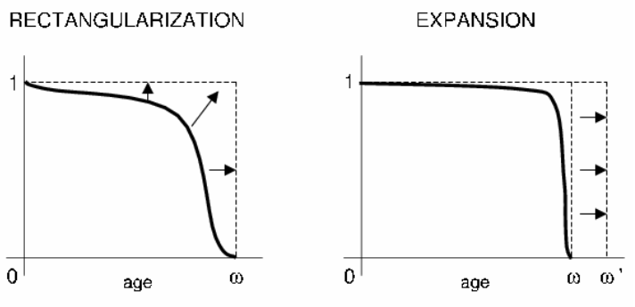

```{r setup, include=FALSE}
knitr::opts_chunk$set(collapse = TRUE, warning = FALSE, message = FALSE)
```

```{r libraries,  echo=FALSE}
library (demography)
#install.packages("kableExtra")
library(kableExtra)
```


{}
Click the *Github* button above to see the full source code and additional information about this project.
{}


## Goals and hypothesis

The goal of this project is to make a comparison on the evolution of mortality and life expectancy in Great Britain and France, verifying whether the geographical proximity has produced a different demographic development in the two different countries, considering a period from 1922 to 2018. The relevance of this study consists in highlighting the possible links between historical events, such as wars and epidemics, the different climates, lifestyles and the evolution of the population structure of the two countries.

## Socioeconomic characteristics of the countries

### Great Britain

The great demographic development of Great Britain is mainly linked to the period of the industrial revolution, which led to a general improvement in economic conditions and a progressive urbanization of rural populations. The population grew until the beginning of the 20th century, and then denoted stationary characters, with a notable increase in the population in old age. According to data provided by the Office for national statistics (2014), in fact, people over 65 represent about 17.4% of the population. To date, the growth rate is mainly due to immigration, mostly from Commonwealth countries and from the former Asian (India, Pakistan) and African (Nigeria, Ghana, Southern Africa) colonies. 

Home of the industrial revolution and the nerve center of financial and commercial exchanges, the past and present continue to make Great Britain one of the richest and most advanced countries in the world. Its economic development was the result of an equally strong cultural development. All of these factors led to the birth of the oldest industrial economy in the world. Today Britain's economy is still largely based on industry, but nearly three-quarters of wealth now comes from service activities - first of all banking and finance. Furthermore, the British economy also depends a lot on a very dense foreign exchange: imports and exports are absolutely vital.


### France

France is the second country by number of inhabitants among the EU countries. Despite the high number of inhabitants, thanks to its large territorial size, it is characterized by a particularly low population density compared to other large European countries and by an uneven distribution on the territory. In fact, about one sixth of the French live in the Parisian agglomeration. The population growth rate is among the strongest in Europe, thanks to a birth rate above the European average and a positive migratory balance. An important component of the French population is in fact represented by immigrants, to which must be added a substantial share of the population of foreign origin now naturalized French. 

According to INSEE, it is estimated that there are 6.7 million immigrants (foreigners born outside the territory), representing 11% of the population, mainly from the European Union (34%), from the Maghreb (30%), Asia (14%, of which one third from Turkey) and Sub-Saharan Africa (11%). After a long period of stagnation manifested in the years preceding the First World War and partially connected with the low demographic growth, the French economy during the 20th century underwent a radical process of renewal and strengthening both in the industrial and agricultural fields. , which led it to rank among the most economically advanced countries.


## Data and tools

The data has been obtained from the Human Mortality Database
([HMD](http://www.mortality.org)), developed by the [Department of Demography of the University of California, Berkeley (USA)](https://www.berkeley.edu) and freely available online, which provides information on mortality - statistics relating to the distribution by age of deaths and population, rates and mortality tables - of 38 countries from the 19th century to the present, provided by the statistical centers of the various countries. 

For this project, in order to make a correct comparison of the two countries, the period 1922-2018 was considered, as they are the only data available for Great Britain (for France the data start from 1816).

The French data were made available by [INSEE](https://www.insee.fr), while those relating to Great Britain by the [Office for National Statistics](https://www.ons.gov.uk) and the [General Register Office for Scotland](https://www.genguide.co.uk). 
The analysis was conducted in R and the `demography` package.


### Importing data from HMD

To obtain the data from the HMD it is necessary to create an account on the official site and then, using the credentials, it is possible to import the required data directly with R, using the `demography` package (see the [documentation](https://cran.rproject.org/web/packages/demography)).

For example, the code below shows how to import death rates data:


```{r example-code1, eval=FALSE}
gb_mx <- hmd.mx("GBR_NP", "username", "password", "Great Britain")

fr_mx <- hmd.mx("FRATNP", "username", "password", "France")
```


```{r load-mx-data, echo=FALSE, message=FALSE, warning=FALSE}
gb_mx <- hmd.mx("GBR_NP",
                  keyring::key_get("id", keyring ="hmd"),
                  keyring::key_get("pw", keyring ="hmd"),
                  "Great Britain")

fr_mx <- hmd.mx("FRATNP",
                keyring::key_get("id", keyring ="hmd"),
                keyring::key_get("pw", keyring ="hmd"),
                "France")
```


The `hmd.mx()` function returns an object of the class `demogdata` with the following structure (example for Great Britain):

```{r str}
class(gb_mx)

str(gb_mx)
```


The time series data for life expectancy at birth ( $e_0$ ) are imported using the `hmd.e0()` function, which returns an `mts` object (multivariate time series).

```{r example-code2, eval=FALSE}
gb_e0 <- hmd.e0("GBR_NP", "username", "password") 

fr_e0 <- hmd.e0("FRATNP", "username", "password") 
```


## Log death rates

The figures below show the *log death rates* by age of both total populations from 1922 to 2018. Each line represents the cohort of a given year, with the oldest years plotted in red and the most recent values in purple. Mortality rates are commonly plotted on a log scale to better visualize small changes.


```{r ldr-gbfr, echo=FALSE, fig.cap="Log death rates by age (sex: total) - Great Britain vs France"}
par(mfrow = c(1,2), mar = c(7,4,5,1))
plot(gb_mx, series=names(gb_mx$rate)[3], year=1922:2018,
     main="Great Britain",cex.main=1)
plot(fr_mx, series=names(fr_mx$rate)[3], year=1922:2018,
     main="France",cex.main=1)
```


From these plots, it can be seen that mortality rates have fallen at all ages: the 20th century saw a compression of mortality due to increased prevention, which delayed the onset of fatal diseases and reduced their lethality. The main difference when comparing the graphs for the two countries is mainly due to historical events: in May 1940, and for the duration of World War II, France was invaded by Germany and suffered a loss of 2.3 million people, men and women, which was not the case in Britain because German troops never crossed the English Channel.

Similarly, it is possible to plot log death rates by years, in order to observe the time series of death rates for any particular age. In this case, the younger age groups are plotted in purple, while those for the older ages are plotted in red.

```{r ldr-year, echo=FALSE, fig.cap="Log death rates by year (sex: total) - Great Britain vs France"}
# Plot log death rates by year (sex: total) ####

par(mfrow = c(1,2), mar = c(7,4,4,1))
plot(gb_mx, series=names(gb_mx$rate)[3], year=1922:2018,
     plot.type=c("time"),xlab="Year", ylim=c(-10,2.5),
     main="Great Britain",cex.main=1)
plot(fr_mx, series=names(fr_mx$rate)[3], year=1922:2018,
     plot.type=c("time"),xlab="Year", ylim=c(-10,2.5),
     main="France",cex.main=1)
```


## Life expectancy at birth series {#e0}

Life expectancy at birth is defined as the average number of years that, given the mortality rate of the country, an individual can 'hope' to live at the time of his or her birth. 

The figure for life expectancy in Great Britain and France confirms the above: mortality levels have generally fallen, while life expectancy has followed a monotonous upward trend, except for the events of World War II.


```{r load-e0-data, echo=FALSE, message=FALSE, warning=FALSE}
### Load life expectancy at birth (e0) time series from HMD ####
gb_e0 <- hmd.e0("GBR_NP",
                keyring::key_get("id", keyring ="hmd"),
                keyring::key_get("pw", keyring ="hmd")) 

fr_e0 <- hmd.e0("FRATNP",
                keyring::key_get("id", keyring ="hmd"),
                keyring::key_get("pw", keyring ="hmd")) 
```

```{r e0ts-gb, echo=FALSE, fig.cap="Great Britain - Life expectancy at birth series 1922-2018"}
plot(gb_e0, xlab="Year",
     main = "Great Britain - Life expectancy at birth series 1922-2018")
```


In France, peaks can be seen during the years of the German invasion, which marked both male and female life expectancy, albeit with less intensity. This phenomenon, as already mentioned, is not present in Great Britain, where the decline in life expectancy is found mainly in the male population, rather than in the female one, for obvious reasons. Furthermore, when comparing plots by gender, it can be seen that, in general, the female life expectancy curve has consistently dominated in recent years.


```{r e0ts-fr, echo=FALSE, fig.cap="France - Life expectancy at birth series 1922-2018"}
plot(window(fr_e0, start = 1922, end = 2018), xlab="Year",
     main = "France - Life expectancy at birth series 1922-2018")
```


## Life tables and ex curves

Below are the mortality tables for Great Britain and France (total populations) for the year 2018.  


```{r lifetable-2018, echo=FALSE}
# Life tables 2018 (sex: total) ####

gb_lt2018 <- lifetable(gb_mx, series = names(gb_mx$rate)[3], years = 2018,
                       ages = gb_mx$age, max.age = min(110, max(gb_mx$age)),
                       type = c("period"))

fr_lt2018 <- lifetable(fr_mx, series = names(fr_mx$rate)[3], years = 2018,
                       ages = fr_mx$age, max.age = min(110, max(fr_mx$age)),
                       type = c("period"))
```



```{r lifetable-2018-gb, echo=FALSE}
gb_lt2018
```




```{r lifetable-2018-fr, echo=FALSE}
fr_lt2018
```



Using the mortality tables from 1922 to 2018 it is possible to plot the life expectancy curves for each age. Similar to the log death rates figures, younger age groups are plotted in purple while those for older ages are plotted in red.

```{r lifetable-1922-2018, echo=FALSE}
# Life tables 1922-2018 (sex: total) ####

gb_lt <- lifetable(gb_mx, series = names(gb_mx$rate)[3], years = gb_mx$year,
                   ages = gb_mx$age, max.age = min(110, max(gb_mx$age)),
                   type = c("period"))

fr_lt <- lifetable(fr_mx, series = names(fr_mx$rate)[3], years = 1922:2018,
                   ages = fr_mx$age, max.age = min(110, max(fr_mx$age)),
                   type = c("period"))
```


```{r ex-gb-fr, echo=FALSE, fig.cap="Life expectancies by age (sex: total) - Great Britain vs France"}
# Plot life expectancy curves by age (sex: total) ####

par(mfrow = c(1,2), mar = c(7,4,5,1))
plot(gb_lt, main = "Great Britain", cex.main = 1, ylab = "ex")
plot(fr_lt, main = "France", cex.main = 1, ylab = "ex")
```


## Survival and death curves

By comparing the survival and death curves in the two countries, more information can be obtained on their demographic evolution over the years considered in the sample. A common phenomenon characterising the survival curves of many Western countries over the last century is known as *rectangularization*, whereby there is an increasing concentration of deaths around the mode (at older ages). This phenomenon affects the survivor function ( $l_x$ ), which takes on an increasingly rectangular shape over time (*curve squaring concept*). A direct consequence of rectangularization is the *expansion* of the survival function, where the mode of the death curve tends to coincide with the maximum  observed age. 



It is possible to measure the shape of the curve $l_x$ through an index known as the *“index of mortality entropy”*, or *H index*, defined as:

$$H_a = - \frac{\int_{a}^{\omega } log \ l(x) \cdot  l(x) \ dx}{\int_{a}^{\omega } l(x) \ dx}$$


where $a$ is the initial age (e.g. $a = 0$ is equivalent to the birth event), $\omega$ is the terminal age and $l(x)$ are the survivors according to life tables. In human populations, $0 < H < 1$.

This index expresses the weighted average of the logarithms of $l_x$ and can be interpreted as the percentage change in life expectancy produced by a 1% reduction in the mortality force at all ages.  When $H = 0$ there is no variability in life expectancy (everyone dies at exactly the same age) and so the $l_x$  curve will be completely rectangular. If the survival curve decreases linearly with age (the number of deaths is the same at all ages), $H = 0.5$. Finally, if mortality is independent of age (the force of mortality is equal at all ages) $H = 1$ (Keyfitz, 1977; Nagnur, 1986; Nusselder and Mackenbach, 1996). 

By comparing the survival curves of Great Britain and France in 1922 and 2018 and the H index trends, it is evident how the demographic evolution of the two countries has been affected by the phenomena of rectangularisation and expansion just described.


```{r lifetable-1922, echo=FALSE}
# Life tables 1922 (sex: total) ####

gb_lt1922 <- lifetable(gb_mx, series = names(gb_mx$rate)[3], years = 1922,
                       ages = gb_mx$age, max.age = min(110, max(gb_mx$age)),
                       type = c("period"))

fr_lt1922 <- lifetable(fr_mx, series = names(fr_mx$rate)[3], years = 1922,
                       ages = fr_mx$age, max.age = min(110, max(fr_mx$age)),
                       type = c("period"))
```


```{r h-index, echo=FALSE}
# Calculate Index of Mortality Entropy (Keyfitz H-index) - Great Britain ####

gb_H <- rep(1,97)
gb_year <- seq(1922,2018,1)

for (index in 1:97) {
  
  gb_ltyear <- lifetable(gb_mx, series = names(gb_mx$rate)[3],
                         years = gb_mx$year[index], ages =gb_mx$age,
                         max.age = min(100, max(gb_mx$age)),
                         type = c("period"))
  
  gb_lx_year <- gb_ltyear$lx
  
  gb_ln_lx_year <- log(gb_lx_year)
  gb_ln_lx_year
  
  gb_product_year <- gb_ln_lx_year * gb_lx_year
  gb_product_year
  
  gb_sum_product_year <- sum(gb_product_year)
  gb_sum_product_year
  
  gb_sum_dem_year <- sum(gb_lx_year)
  gb_sum_dem_year
  
  gb_H_year <- -(gb_sum_product_year / gb_sum_dem_year)
  gb_H_year
  gb_H[index] = gb_H_year
}

gb_Hseries <- cbind(Year=gb_year, H_index=gb_H)


# Calculate Index of Mortality Entropy (Keyfitz H-index) - France ####

fr_H <- rep(1,203)
fr_year <- seq(1816,2018,1)

for (index in 1:203) {
  
  fr_ltyear <- lifetable(fr_mx, series = names(fr_mx$rate)[3],
                         years = fr_mx$year[index], ages=fr_mx$age,
                         max.age = min(100, max(fr_mx$age)),
                         type = c("period"))
  
  fr_lx_year <- fr_ltyear$lx
  
  fr_ln_lx_year <- log(fr_lx_year)
  fr_ln_lx_year
  
  fr_product_year <- fr_ln_lx_year * fr_lx_year
  fr_product_year
  
  fr_sum_product_year <- sum(fr_product_year)
  fr_sum_product_year
  
  fr_sum_dem_year <- sum(fr_lx_year)
  fr_sum_dem_year
  
  fr_H_year <- -(fr_sum_product_year / fr_sum_dem_year)
  fr_H_year
  fr_H[index] = fr_H_year
}


# Subset only values from 1922 to 2018
fr_Hseries <- cbind(Year=fr_year[107:203], H_index=fr_H[107:203])
```


```{r lx-h-index-plot, echo=FALSE, fig.cap="Survival Curves and Rectangularization"}
# Plot lx curves and H index series #####

par(mfrow = c(1,2), mar = c(7,4,5,1))

plot(gb_lt1922$lx, col="blue", xlab="Age", ylab="lx", type="l",
     lty=2,main = "Survival Curves")
lines(fr_lt1922$lx, col="red", lty=2)
lines(gb_lt2018$lx, col="blue", lty=1)
lines(fr_lt2018$lx, col="red", lty=1)

legend("topright",c("GB 1922", "FR 1922", "GB 2018", "FR 2018"),
       col=c("blue", "red","blue", "red"),
       lty=c(2,2,1,1), cex = 0.5)


plot(gb_Hseries[,1], gb_Hseries[,2], type = "l", xlab="Year", ylab="H index",
     col="blue", ylim = c(0.1,0.5),main="Index of Mortality Entropy")
lines(x=fr_Hseries[,1], y=fr_Hseries[,2], col="red")
legend("topright" , c("Great Britain", "France"),cex=0.5,
       col=c("blue","red"),lty=1)
```


Through the following 3D plots we can also observe, from a perspective point of view, the evolution of the $l_x$ over all the years considered for the study. It’s interesting to note the formation of a “wave”, which becomes progressively higher over time, due to the fact that in earlier years mortality at younger ages was higher, leading to a more pronounced drop in the lines referring to the oldest mortality tables.


```{r 3d-lx, echo=FALSE, fig.cap="3D lx curves by age and year"}
# Plot 3D lx Curves by age and year ####

par(mfrow = c(1,2), mar = c(2,1,5,1))

persp(gb_lt$age, gb_lt$year, gb_lt$lx, theta = 40, xlab = "age",
      ylab = "year", zlab = "lx", main = "Great Britain")

persp(fr_lt$age, fr_lt$year, fr_lt$lx, theta = 40, xlab = "age",
      ylab = "year", zlab = "lx", main = "France")
```


The opposite prospective situation from the previous plot can be studied by placing the proportion of deaths ( $dx$ ) on the vertical axis, from which it is possible to focus on the rapid fall in mortality at birth.


```{r 3d-dx, echo=FALSE, fig.cap="3D dx curves by age and year"}
# Plot 3D dx Curves by age and year ####

par(mfrow = c(1,2), mar = c(2,1,5,1))

persp(gb_lt$age, gb_lt$year, gb_lt$dx, theta = 40, xlab = "age",
      ylab = "year", zlab = "lx", main = "Great Britain")

persp(fr_lt$age, fr_lt$year, fr_lt$dx, theta = 40, xlab = "age",
      ylab = "year", zlab = "lx", main = "France")
```


## Lee Carter model

### Model specification

In order to obtain a projection of future trends in global and sex-specific mortality in the two countries, the **Lee-Carter model** was estimated using data available in the 1922-2018 sub-period. The model is defined as follows:

$$m_x(t) = e^{(\alpha_x + \beta_x K_t + \varepsilon_{x,t})}$$

or in a log-bilinear form:

$$ln \ m_x(t) = \alpha_x + \beta_x K_t + \varepsilon_{x,t}$$

where:
- $m_x(t) = \frac{d_x}{L_x}$ is the central death rate for age $x$ at time $t$. It is assumed to behave exponentially, and the parameters $\alpha$ and $\beta$ remain constant over time but varying across age. The mortality evolution is therefore represented by the index $K_t$, which changes over time.
- $\alpha_x$ is the average of $ln \ m_x(t)$ in the whole observation period. It describes the pattern of mortality by age.
- $K_t$ is the mortality index. It captures the general mortality evolution in the past considering all the ages. Since it is the same for each age, the mortality improvements are perfectly correlated at any age. 
- $\beta_x$ is the sensitivity of $ln \ m_x(t)$ to changes in the mortality index and it measures the average improvement rate of mortality for each age.
- $\varepsilon_{x,t}$ represents the residual term of the model. They should have mean 0 and a given variance $\sigma_{t}^{2}$. If the model is correctly specified, the residuals should be $i.i.d.$ and approximately distributed like a standard normal.


To obtain a unique solution, the following constraints are also applied:
 $\sum_{t} K_{t} = 0$ e $\sum_{x} \beta_{x} = 1$

To estimate the LC model there are several methods. In their original paper, Lee and Carter (1992) suggested the *SVD method* method to find a least squares solution using logarithms of mortality rates. For this analysis, it was decided to use the same approach, as it is the one used by default in the `lca()` function of the `demography` package.

Once we have estimated the parameters, to forecast mortality rates, only the mortality index kt needs to be predicted, since $\alpha_x$ and $\beta_x$ are constant over time.  According to Lee and Carter (1992), it can be modelled as a *random walk with drift*, equivalent to an $ARIMA(0,1,0)$.


### Model results

This section reports the results of the Lee-Carter model estimates, applied to the time series of overall and sex-specific mortality rates for Great Britain and France: summary of the model (total population), plots of the parameter estimates (total population and by sex), the $K_t$ forecast from 2019 to 2050 (plot for total population) and the residuals by age and year (plots for total population).

These are the results for Great Britain:


```{r lc-mod-gb, echo=FALSE}
# Lee-Carter Models - Great Britain ####

gb_LCt <- lca(gb_mx, series=names(gb_mx$rate)[3],
              years=1922:2018, interpolate = TRUE)

gb_LCf <- lca(gb_mx, series=names(gb_mx$rate)[1],
              years=1922:2018,interpolate = TRUE)

gb_LCm <- lca(gb_mx, series=names(gb_mx$rate)[2],
              years=1922:2018, interpolate = TRUE)
```


```{r summary-lc-gb, echo=FALSE}
summary(gb_LCt)
```



```{r lc-estimates-gb, echo=FALSE, fig.cap="Results from Lee-Carter model - Great Britain"}
# Model results and plots - Great Britain ####


par(mfrow = c(2,3), mar = c(4,4,2,2))
plot(gb_LCt$ax, main="ax", xlab="Age",ylab="ax",type="l")
lines(x=gb_LCf$age, y=gb_LCf$ax, main="ax", col="red")
lines(x=gb_LCm$age, y=gb_LCm$ax, main="ax", col="blue")
legend("topleft" , c("Total","Female","Male"),cex=0.8,
       col=c("black","red","blue"),lty=1)

plot(gb_LCt$bx, main="bx", xlab="Age",ylab="bx",type="l")
lines(x=gb_LCf$age, y=gb_LCf$bx, main="bx", col="red")
lines(x=gb_LCm$age, y=gb_LCm$bx, main="bx", col="blue")
legend("topright" , c("Total","Female","Male"),cex=0.8,
       col=c("black","red","blue"),lty=1)

plot(gb_LCt$kt, main="Kt", xlab="Year",ylab="Kt",type="l")
lines(x=gb_LCf$year, y=gb_LCf$kt, main="Kt", col="red")
lines(x=gb_LCm$year, y=gb_LCm$kt, main="Kt", col="blue")
legend("topright" , c("Total","Female","Male"),cex=0.8,
       col=c("black","red","blue"),lty=1)

plot(forecast(gb_LCt, h = 32)$kt, main="Forecast form ARIMA(0,1,0)",
     xlab = "Year", ylab = "kt")

gb_LCt_res=residuals(gb_LCt, "residuals")

plot(rep(gb_LCt_res$y,length(gb_LCt_res$x)),(gb_LCt_res$z), xlab="Age",
     ylab="residuals",main="Residuals by ages")


plot(rep(gb_LCt_res$x,length(gb_LCt_res$y)),(gb_LCt_res$z), xlab="Year",
     ylab="residuals",main="Residuals by years")
```


And these for France:

```{r lc-mod-fr, echo=FALSE}
# Lee-Carter Models - France ####

fr_LCt <- lca(fr_mx, series=names(fr_mx$rate)[3],
              years=1922:2018, interpolate = TRUE)

fr_LCf <- lca(fr_mx, series=names(fr_mx$rate)[1],
              years=1922:2018,interpolate = TRUE)

fr_LCm <- lca(fr_mx, series=names(fr_mx$rate)[2],
              years=1922:2018, interpolate = TRUE)
```



```{r summary-lc-fr, echo=FALSE}
summary(fr_LCt)
```



```{r lc-estimates-fr, echo=FALSE, fig.cap="Results from Lee-Carter model - France"}
# Model results and plots - France ####

par(mfrow = c(2,3), mar = c(4,4,2,2))
plot(fr_LCt$ax, main="ax", xlab="Age",ylab="ax",type="l")
lines(x=fr_LCf$age, y=fr_LCf$ax, main="ax", col="red")
lines(x=fr_LCm$age, y=fr_LCm$ax, main="ax", col="blue")
legend("topleft" , c("Total","Female","Male"),cex=0.8,
       col=c("black","red","blue"),lty=1)

plot(fr_LCt$bx, main="bx", xlab="Age",ylab="bx",type="l")
lines(x=fr_LCf$age, y=fr_LCf$bx, main="bx", col="red")
lines(x=fr_LCm$age, y=fr_LCm$bx, main="bx", col="blue")
legend("topright" , c("Total","Female","Male"),cex=0.8,
       col=c("black","red","blue"),lty=1)

plot(fr_LCt$kt, main="kt", xlab="Year",ylab="kt",type="l")
lines(x=fr_LCf$year, y=fr_LCf$kt, main="kt", col="red")
lines(x=fr_LCm$year, y=fr_LCm$kt, main="kt", col="blue")
legend("topright" , c("Total","Female","Male"),cex=0.8,
       col=c("black","red","blue"),lty=1)

plot(forecast(fr_LCt, h = 32)$kt, main="Forecast form ARIMA(0,1,0)",
     xlab = "Year", ylab = "kt")

fr_LCt_res=residuals(fr_LCt, "residuals")

plot(rep(fr_LCt_res$y,length(fr_LCt_res$x)),(fr_LCt_res$z), xlab="Age",
     ylab="residuals",main="Residuals by ages")


plot(rep(fr_LCt_res$x,length(fr_LCt_res$y)),(fr_LCt_res$z), xlab="Year",
     ylab="residuals",main="Residuals by years")
```


As can be seen from the $\alpha_x$ plots, the mortality averages in both countries rise as age increases. In addition, the phenomenon of the *“accidental hump”* is clearly visible for males aged between 18 and 30.
$\beta_x$, on the other hand, shows a higher value for younger ages that gradually decreases with a clear improvement for females aged 65-80 in France and for males in the 50-80 age group in Great Britain. Finally, $K_t$ has a decreasing trend over time. 


Looking at the residual plots, these concentrating around zero reveal that the model has been estimated correctly.
 


### Comparing actual values and forecasts

Using the Lee-Carter model results for the total populations of both countries, forecasts from 2019 to 2050 of log death rates and life expectancy curves were estimated and compared with actual values for the sub-period 1922-2018.

Values for Great Britain:

```{r lc-forecast-gb, echo=FALSE, fig.cap="Comparison actual and forecast values - Great Britain (sex: total)"}
# Comparison actual and forecast values - Great Britain (sex: total) ####

par(mfrow = c(2,2), mar = c(4,4,2,1))
plot(gb_mx, series=names(gb_mx$rate)[3], year=1922:2018,
     main="Actual (1922-2018)", cex.main=1)
plot(forecast(gb_LCt, h = 32), main="Forecast (2019-2050)", cex.main=1)

plot(gb_lt, main = "Actual (1922-2018)", cex.main = 1,
     ylab = "ex")
plot(lifetable(forecast(gb_LCt, h = 32)),ylab = "ex",
     main="Forecast (2019-2050)", cex.main=1)
```

Values for France:

```{r lc-forecast-fr, echo=FALSE, fig.cap="Comparison actual and forecast values - France (sex: total)"}
# Comparison actual and forecast values - France (sex: total) ####

par(mfrow = c(2,2), mar = c(4,4,2,1))
plot(fr_mx, series=names(fr_mx$rate)[3], year=1922:2018,
     main="Actual (1922-2018)", cex.main=1)
plot(forecast(fr_LCt, h = 32), main="Forecast (2019-2050)", cex.main=1)

plot(fr_lt, main = "Actual (1922-2018)", cex.main = 1,
     ylab = "ex")
plot(lifetable(forecast(fr_LCt, h = 32)),ylab = "ex",
     main="Forecast (2019-2050)", cex.main=1)
```


As expected, looking at the vertical axes of the graphs, the forecasts suggest a progressive improvement in living conditions in both countries with a reduction in mortality at all ages. This positive trend can also be identified by joining the historical series of life expectancy at birth plotted above (see the [section](#e0)) with the projections estimated for the period 2019-2050. 


```{r devoff, echo=FALSE, results='hide'}
dev.off()
```

```{r e0ts-forecast, echo=FALSE, fig.cap="Past and forecast life expectancies at birth - Great Britain vs France"}
# e0 time series (sex: total): joining past and forecast values ####

gb_e0t <- life.expectancy(gb_mx, series=names(gb_mx$rate)[3],
                          years = gb_mx$year, type = c("period"))

gb_e0LCt <- life.expectancy(forecast(gb_LCt, h = 32),type = c("period"))

gb_e0join <- c(gb_e0t, gb_e0LCt)


fr_e0t <- life.expectancy(fr_mx, series=names(fr_mx$rate)[3],
                          years = 1922:2018, type = c("period"))

fr_e0LCt <- life.expectancy(forecast(fr_LCt, h = 32),type = c("period"))

fr_e0join <- c(fr_e0t, fr_e0LCt)


e0LC_years <- seq(1922, 2050, 1)

plot(x=e0LC_years, y=gb_e0join,type = "l",ylim = c(45,90),
     main ="Life Expectancies (1922-2050)",xlab = "Years",ylab = "e0")
lines(x=e0LC_years, y=fr_e0join, col="blue")
abline(v=2019, col="red")
text(2024, 70, "2019", col="red",cex=0.7)
legend("bottomright" , c("Great Britain", "France"),cex=0.8,
       col=c("black","blue"),lty=1)
```


We can summarise this comparison with the following table, which shows the values of total and gender-specific life expectancies at ages 0, 20, 60 and 80 for the two countries in 2018 and those predicted for 2050. 


```{r proj-lt-ex-tbl, echo=FALSE}

# Projected life table for 2050 ####
gb_lt2050 <- lifetable(forecast(gb_LCt, h = 32), years = 2050)

fr_lt2050 <- lifetable(forecast(fr_LCt, h = 32), years = 2050)


# Comparison e0, e20, e60, e80 in 2018 and 2050 ####

gb_lt2018f <- lifetable(gb_mx, series = names(gb_mx$rate)[1], years = 2018,
                        ages = gb_mx$age, max.age = min(110, max(gb_mx$age)),
                        type = c("period"))

gb_lt2018m <- lifetable(gb_mx, series = names(gb_mx$rate)[2], years = 2018,
                        ages = gb_mx$age, max.age = min(110, max(gb_mx$age)),
                        type = c("period"))


gb_lt2050f <- lifetable(forecast(gb_LCf, h = 32), years = 2050)
gb_lt2050m <- lifetable(forecast(gb_LCm, h = 32), years = 2050)


fr_lt2018f <- lifetable(fr_mx, series = names(fr_mx$rate)[1], years = 2018,
                        ages = fr_mx$age, max.age = min(110, max(fr_mx$age)),
                        type = c("period"))

fr_lt2018m <- lifetable(fr_mx, series = names(fr_mx$rate)[2], years = 2018,
                        ages = fr_mx$age, max.age = min(110, max(fr_mx$age)),
                        type = c("period"))


fr_lt2050f <- lifetable(forecast(fr_LCf, h = 32), years = 2050)
fr_lt2050m <- lifetable(forecast(fr_LCm, h = 32), years = 2050)


e0_2018GBf <- gb_lt2018f$ex[1]
e20_2018GBf <- gb_lt2018f$ex[21]
e60_2018GBf <- gb_lt2018f$ex[61]
e80_2018GBf <- gb_lt2018f$ex[81]

e0_2018GBm <- gb_lt2018m$ex[1]
e20_2018GBm <- gb_lt2018m$ex[21]
e60_2018GBm <- gb_lt2018m$ex[61]
e80_2018GBm <- gb_lt2018m$ex[81]

e0_2018GBt <- gb_lt2018$ex[1]
e20_2018GBt <- gb_lt2018$ex[21]
e60_2018GBt <- gb_lt2018$ex[61]
e80_2018GBt <- gb_lt2018$ex[81]

e0_2050GBf <- gb_lt2050f$ex[1]
e20_2050GBf <- gb_lt2050f$ex[21]
e60_2050GBf <- gb_lt2050f$ex[61]
e80_2050GBf <- gb_lt2050f$ex[81]

e0_2050GBm <- gb_lt2050m$ex[1]
e20_2050GBm <- gb_lt2050m$ex[21]
e60_2050GBm <- gb_lt2050m$ex[61]
e80_2050GBm <- gb_lt2050m$ex[81]

e0_2050GBt <- gb_lt2050$ex[1]
e20_2050GBt <- gb_lt2050$ex[21]
e60_2050GBt <- gb_lt2050$ex[61]
e80_2050GBt <- gb_lt2050$ex[81]

e0_2018FRf <- fr_lt2018f$ex[1]
e20_2018FRf <- fr_lt2018f$ex[21]
e60_2018FRf <- fr_lt2018f$ex[61]
e80_2018FRf <- fr_lt2018f$ex[81]

e0_2018FRm <- fr_lt2018m$ex[1]
e20_2018FRm <- fr_lt2018m$ex[21]
e60_2018FRm <- fr_lt2018m$ex[61]
e80_2018FRm <- fr_lt2018m$ex[81]

e0_2018FRt <- fr_lt2018$ex[1]
e20_2018FRt <- fr_lt2018$ex[21]
e60_2018FRt <- fr_lt2018$ex[61]
e80_2018FRt <- fr_lt2018$ex[81]

e0_2050FRf <- fr_lt2050f$ex[1]
e20_2050FRf <- fr_lt2050f$ex[21]
e60_2050FRf <- fr_lt2050f$ex[61]
e80_2050FRf <- fr_lt2050f$ex[81]

e0_2050FRm <- fr_lt2050m$ex[1]
e20_2050FRm <- fr_lt2050m$ex[21]
e60_2050FRm <- fr_lt2050m$ex[61]
e80_2050FRm <- fr_lt2050m$ex[81]

e0_2050FRt <- fr_lt2050$ex[1]
e20_2050FRt <- fr_lt2050$ex[21]
e60_2050FRt <- fr_lt2050$ex[61]
e80_2050FRt <- fr_lt2050$ex[81]


# Merge values into a data frame ####

data_ex <- data.frame(
  Country = c(rep("GB",3),rep("FR",3)),
  Sex = c(rep(c("F","M","T"),2)),
  e0_2018 = c(e0_2018GBf,e0_2018GBm,e0_2018GBt,
              e0_2018FRf,e0_2018FRm,e0_2018FRt),
  e0_2050 = c(e0_2050GBf,e0_2050GBm,e0_2050GBt,
              e0_2050FRf,e0_2050FRm,e0_2050FRt),
  e20_2018 = c(e20_2018GBf,e20_2018GBm,e20_2018GBt,
              e20_2018FRf,e20_2018FRm,e20_2018FRt),
  e20_2050 = c(e20_2050GBf,e20_2050GBm,e20_2050GBt,
              e20_2050FRf,e20_2050FRm,e20_2050FRt),
  e60_2018 = c(e60_2018GBf,e60_2018GBm,e60_2018GBt,
              e60_2018FRf,e60_2018FRm,e60_2018FRt),
  e60_2050 = c(e60_2050GBf,e60_2050GBm,e60_2050GBt,
              e60_2050FRf,e60_2050FRm,e60_2050FRt),
  e80_2018 = c(e80_2018GBf,e80_2018GBm,e80_2018GBt,
              e80_2018FRf,e80_2018FRm,e80_2018FRt),
  e80_2050 = c(e80_2050GBf,e80_2050GBm,e80_2050GBt,
              e80_2050FRf,e80_2050FRm,e80_2050FRt))
```


```{r table-ex, echo=FALSE}
# Create a table in HTML format ####
kbl(data_ex,format = "html",digits = 1,
    col.names = c(" ", " ", "2018", "2050","2018", "2050",
                  "2018", "2050", "2018", "2050")) %>%
  kable_styling(c("striped")) %>%
  column_spec(column = c(2:10),extra_css = "vertical-align:middle;") %>%
  add_header_above(c(" " = 2, "e0" = 2, "e20" = 2, "e60" = 2, "e80" = 2))

```

First of all, we can focus on the differences between males and females within each country: for each age considered, women's life expectancies are generally higher, or equal in some cases. Among other reasons, this is mainly due to different lifestyles and daily habits: women generally stay healthy longer than men, do less strenuous work, and above all generally smoke and drink less than men. 


However, there is still no single interpretation of this theory, as recent studies have shown that women also smoke and drink more than men. Whether this behaviour will reduce the gender gap or not will be seen over time.

Comparing the values of men and women between the two countries it can be seen that life expectancy is always higher in France for women, while there are no significant differences for males. This may also be due to the different lifestyles of French and British women, as well as the different climates to which they are exposed.


Finally, projected life tables for 2050 were estimated.



```{r lifetable-2050-gb, echo=FALSE}
gb_lt2050
```




```{r lifetable-2050-fr, echo=FALSE}
fr_lt2050
```



## Conclusion

Contrary to the hypothesis, geographic proximity seems to have produced the same evolution of the population structure in the two countries analysed: both in France and in Great Britain mortality rates have decreased for all ages, survival curves have experienced the canonical effects of rectangularisation and expansion and even life expectancy forecasts derived from the Lee-Carter model show that the two countries have had more or less the same evolution.


## References

- Keyfitz, N., (1977), *“Applied Mathematical Demography”*, Wiley, New York, New York, USA 
- Lee, R.D., Carter, L.R., (1992), *“Modeling and Forecasting U. S. Mortality”*, Journal of the American Statistical Association Vol. 87, No. 419, 659-671
- Nagnur, D., (1986), *“Rectangularization of the survival curve and entropy: The Canadian experience, 1921-1981”*, Canadian Studes in Population, Vol. 13, 83-102
- Nusselder, W. J., Mackenbach, J. P., (1996), *“Rectangularization of the Survival Curve in the Netherlands, 1950-1992”*, The Cerontologist, Vol. 36, No. 6, 773-782
- [General Register Office for Scotland](https://www.genguide.co.uk/)
- [Human Mortality Database](https://www.mortality.org/)
- [INSEE](https://www.insee.fr/fr/accueil)
- [Office for National Statistics](https://www.ons.gov.uk/)
- [Reference manual of the demography package](https://cran.rproject.org/web/packages/demography/demography.pdf)

