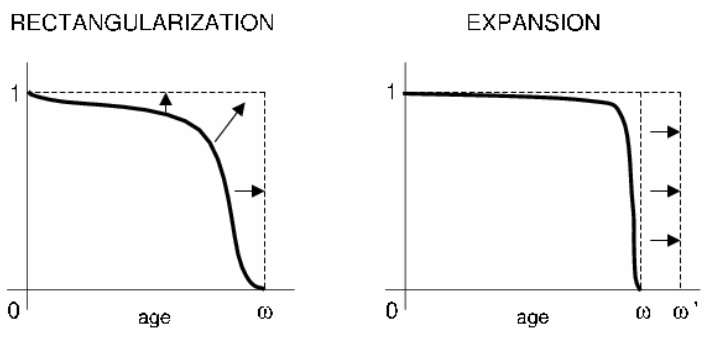

<script src="index.en_files/kePrint/kePrint.js"></script>
<link href="index.en_files/lightable/lightable.css" rel="stylesheet" />


{}
Click the *Github* button above to see the full source code and additional information about this project.
{}


## Goals and hypothesis

The goal of this project is to make a comparison on the evolution of mortality and life expectancy in Great Britain and France, verifying whether the geographical proximity has produced a different demographic development in the two different countries, considering a period from 1922 to 2018. The relevance of this study consists in highlighting the possible links between historical events, such as wars and epidemics, the different climates, lifestyles and the evolution of the population structure of the two countries.

## Socioeconomic characteristics of the countries

### Great Britain

The great demographic development of Great Britain is mainly linked to the period of the industrial revolution, which led to a general improvement in economic conditions and a progressive urbanization of rural populations. The population grew until the beginning of the 20th century, and then denoted stationary characters, with a notable increase in the population in old age. According to data provided by the Office for national statistics (2014), in fact, people over 65 represent about 17.4% of the population. To date, the growth rate is mainly due to immigration, mostly from Commonwealth countries and from the former Asian (India, Pakistan) and African (Nigeria, Ghana, Southern Africa) colonies. 

Home of the industrial revolution and the nerve center of financial and commercial exchanges, the past and present continue to make Great Britain one of the richest and most advanced countries in the world. Its economic development was the result of an equally strong cultural development. All of these factors led to the birth of the oldest industrial economy in the world. Today Britain's economy is still largely based on industry, but nearly three-quarters of wealth now comes from service activities - first of all banking and finance. Furthermore, the British economy also depends a lot on a very dense foreign exchange: imports and exports are absolutely vital.


### France

France is the second country by number of inhabitants among the EU countries. Despite the high number of inhabitants, thanks to its large territorial size, it is characterized by a particularly low population density compared to other large European countries and by an uneven distribution on the territory. In fact, about one sixth of the French live in the Parisian agglomeration. The population growth rate is among the strongest in Europe, thanks to a birth rate above the European average and a positive migratory balance. An important component of the French population is in fact represented by immigrants, to which must be added a substantial share of the population of foreign origin now naturalized French. 

According to INSEE, it is estimated that there are 6.7 million immigrants (foreigners born outside the territory), representing 11% of the population, mainly from the European Union (34%), from the Maghreb (30%), Asia (14%, of which one third from Turkey) and Sub-Saharan Africa (11%). After a long period of stagnation manifested in the years preceding the First World War and partially connected with the low demographic growth, the French economy during the 20th century underwent a radical process of renewal and strengthening both in the industrial and agricultural fields. , which led it to rank among the most economically advanced countries.


## Data and tools

The data has been obtained from the Human Mortality Database
([HMD](http://www.mortality.org)), developed by the [Department of Demography of the University of California, Berkeley (USA)](https://www.berkeley.edu) and freely available online, which provides information on mortality - statistics relating to the distribution by age of deaths and population, rates and mortality tables - of 38 countries from the 19th century to the present, provided by the statistical centers of the various countries. 

For this project, in order to make a correct comparison of the two countries, the period 1922-2018 was considered, as they are the only data available for Great Britain (for France the data start from 1816).

The French data were made available by [INSEE](https://www.insee.fr), while those relating to Great Britain by the [Office for National Statistics](https://www.ons.gov.uk) and the [General Register Office for Scotland](https://www.genguide.co.uk). 
The analysis was conducted in R and the `demography` package.


### Importing data from HMD

To obtain the data from the HMD it is necessary to create an account on the official site and then, using the credentials, it is possible to import the required data directly with R, using the `demography` package (see the [documentation](https://cran.rproject.org/web/packages/demography)).

For example, the code below shows how to import death rates data:


```r
gb_mx <- hmd.mx("GBR_NP", "username", "password", "Great Britain")

fr_mx <- hmd.mx("FRATNP", "username", "password", "France")
```


The `hmd.mx()` function returns an object of the class `demogdata` with the following structure (example for Great Britain):


```r
class(gb_mx)
## [1] "demogdata"

str(gb_mx)
## List of 7
##  $ type  : chr "mortality"
##  $ label : chr "Great Britain"
##  $ lambda: num 0
##  $ year  : int [1:97] 1922 1923 1924 1925 1926 1927 1928 1929 1930 1931 ...
##  $ age   : num [1:111] 0 1 2 3 4 5 6 7 8 9 ...
##  $ pop   :List of 3
##   ..$ female: num [1:111, 1:97] 446850 452481 427578 359373 326025 ...
##   .. ..- attr(*, "dimnames")=List of 2
##   .. .. ..$ : chr [1:111] "0" "1" "2" "3" ...
##   .. .. ..$ : chr [1:97] "1922" "1923" "1924" "1925" ...
##   ..$ male  : num [1:111, 1:97] 461922 463988 439102 367637 331448 ...
##   .. ..- attr(*, "dimnames")=List of 2
##   .. .. ..$ : chr [1:111] "0" "1" "2" "3" ...
##   .. .. ..$ : chr [1:97] "1922" "1923" "1924" "1925" ...
##   ..$ total : num [1:111, 1:97] 908771 916469 866680 727010 657474 ...
##   .. ..- attr(*, "dimnames")=List of 2
##   .. .. ..$ : chr [1:111] "0" "1" "2" "3" ...
##   .. .. ..$ : chr [1:97] "1922" "1923" "1924" "1925" ...
##  $ rate  :List of 3
##   ..$ female: num [1:111, 1:97] 0.07005 0.02498 0.01214 0.00607 0.00443 ...
##   .. ..- attr(*, "dimnames")=List of 2
##   .. .. ..$ : chr [1:111] "0" "1" "2" "3" ...
##   .. .. ..$ : chr [1:97] "1922" "1923" "1924" "1925" ...
##   ..$ male  : num [1:111, 1:97] 0.09257 0.02726 0.01298 0.00632 0.0043 ...
##   .. ..- attr(*, "dimnames")=List of 2
##   .. .. ..$ : chr [1:111] "0" "1" "2" "3" ...
##   .. .. ..$ : chr [1:97] "1922" "1923" "1924" "1925" ...
##   ..$ total : num [1:111, 1:97] 0.0815 0.02613 0.01257 0.0062 0.00436 ...
##   .. ..- attr(*, "dimnames")=List of 2
##   .. .. ..$ : chr [1:111] "0" "1" "2" "3" ...
##   .. .. ..$ : chr [1:97] "1922" "1923" "1924" "1925" ...
##  - attr(*, "class")= chr "demogdata"
```


The time series data for life expectancy at birth ( `\(e_0\)` ) are imported using the `hmd.e0()` function, which returns an `mts` object (multivariate time series).


```r
gb_e0 <- hmd.e0("GBR_NP", "username", "password") 

fr_e0 <- hmd.e0("FRATNP", "username", "password") 
```


## Log death rates

The figures below show the *log death rates* by age of both total populations from 1922 to 2018. Each line represents the cohort of a given year, with the oldest years plotted in red and the most recent values in purple. Mortality rates are commonly plotted on a log scale to better visualize small changes.


<div class="figure">
}}index.en_files/figure-html/ldr-gbfr-1.png" alt="Log death rates by age (sex: total) - Great Britain vs France" width="672" />
<p class="caption">Figure 1: Log death rates by age (sex: total) - Great Britain vs France</p>
</div>


From these plots, it can be seen that mortality rates have fallen at all ages: the 20th century saw a compression of mortality due to increased prevention, which delayed the onset of fatal diseases and reduced their lethality. The main difference when comparing the graphs for the two countries is mainly due to historical events: in May 1940, and for the duration of World War II, France was invaded by Germany and suffered a loss of 2.3 million people, men and women, which was not the case in Britain because German troops never crossed the English Channel.

Similarly, it is possible to plot log death rates by years, in order to observe the time series of death rates for any particular age. In this case, the younger age groups are plotted in purple, while those for the older ages are plotted in red.

<div class="figure">
}}index.en_files/figure-html/ldr-year-1.png" alt="Log death rates by year (sex: total) - Great Britain vs France" width="672" />
<p class="caption">Figure 2: Log death rates by year (sex: total) - Great Britain vs France</p>
</div>


## Life expectancy at birth series {#e0}

Life expectancy at birth is defined as the average number of years that, given the mortality rate of the country, an individual can 'hope' to live at the time of his or her birth. 

The figure for life expectancy in Great Britain and France confirms the above: mortality levels have generally fallen, while life expectancy has followed a monotonous upward trend, except for the events of World War II.


<div class="figure">
}}index.en_files/figure-html/e0ts-gb-1.png" alt="Great Britain - Life expectancy at birth series 1922-2018" width="672" />
<p class="caption">Figure 3: Great Britain - Life expectancy at birth series 1922-2018</p>
</div>


In France, peaks can be seen during the years of the German invasion, which marked both male and female life expectancy, albeit with less intensity. This phenomenon, as already mentioned, is not present in Great Britain, where the decline in life expectancy is found mainly in the male population, rather than in the female one, for obvious reasons. Furthermore, when comparing plots by gender, it can be seen that, in general, the female life expectancy curve has consistently dominated in recent years.


<div class="figure">
}}index.en_files/figure-html/e0ts-fr-1.png" alt="France - Life expectancy at birth series 1922-2018" width="672" />
<p class="caption">Figure 4: France - Life expectancy at birth series 1922-2018</p>
</div>


## Life tables and ex curves

Below are the mortality tables for Great Britain and France (total populations) for the year 2018.  




```
## Period lifetable for Great Britain : total 
## 
## Year: 2018 
##         mx     qx     lx     dx     Lx      Tx      ex
## 0   0.0038 0.0038 1.0000 0.0038 0.9964 81.1287 81.1287
## 1   0.0002 0.0002 0.9962 0.0002 0.9961 80.1323 80.4369
## 2   0.0001 0.0001 0.9960 0.0001 0.9959 79.1362 79.4567
## 3   0.0001 0.0001 0.9959 0.0001 0.9958 78.1403 78.4646
## 4   0.0001 0.0001 0.9958 0.0001 0.9957 77.1445 77.4728
## 5   0.0001 0.0001 0.9957 0.0001 0.9956 76.1487 76.4788
## 6   0.0001 0.0001 0.9956 0.0001 0.9956 75.1531 75.4856
## 7   0.0001 0.0001 0.9955 0.0001 0.9955 74.1575 74.4920
## 8   0.0001 0.0001 0.9954 0.0001 0.9954 73.1621 73.4971
## 9   0.0001 0.0001 0.9954 0.0001 0.9953 72.1667 72.5023
## 10  0.0001 0.0001 0.9953 0.0001 0.9953 71.1713 71.5062
## 11  0.0001 0.0001 0.9952 0.0001 0.9952 70.1760 70.5123
## 12  0.0001 0.0001 0.9952 0.0001 0.9951 69.1808 69.5178
## 13  0.0001 0.0001 0.9951 0.0001 0.9950 68.1857 68.5231
## 14  0.0001 0.0001 0.9950 0.0001 0.9949 67.1907 67.5299
## 15  0.0002 0.0002 0.9949 0.0002 0.9948 66.1958 66.5378
## 16  0.0002 0.0002 0.9947 0.0002 0.9946 65.2010 65.5492
## 17  0.0003 0.0003 0.9945 0.0002 0.9944 64.2064 64.5617
## 18  0.0003 0.0003 0.9942 0.0003 0.9941 63.2120 63.5777
## 19  0.0004 0.0004 0.9939 0.0004 0.9937 62.2180 62.5995
## 20  0.0004 0.0004 0.9935 0.0004 0.9934 61.2242 61.6218
## 21  0.0004 0.0004 0.9932 0.0004 0.9930 60.2309 60.6434
## 22  0.0004 0.0004 0.9928 0.0004 0.9926 59.2379 59.6667
## 23  0.0004 0.0004 0.9924 0.0004 0.9923 58.2452 58.6892
## 24  0.0004 0.0004 0.9921 0.0004 0.9919 57.2530 57.7108
## 25  0.0005 0.0005 0.9917 0.0004 0.9914 56.2611 56.7340
## 26  0.0004 0.0004 0.9912 0.0004 0.9910 55.2697 55.7594
## 27  0.0004 0.0004 0.9908 0.0004 0.9906 54.2787 54.7832
## 28  0.0005 0.0005 0.9903 0.0005 0.9901 53.2881 53.8074
## 29  0.0006 0.0006 0.9898 0.0005 0.9895 52.2980 52.8360
## 30  0.0006 0.0006 0.9893 0.0006 0.9890 51.3085 51.8649
## 31  0.0006 0.0006 0.9887 0.0006 0.9884 50.3195 50.8947
## 32  0.0006 0.0006 0.9881 0.0006 0.9878 49.3311 49.9259
## 33  0.0007 0.0007 0.9875 0.0007 0.9871 48.3433 48.9572
## 34  0.0008 0.0008 0.9868 0.0008 0.9864 47.3562 47.9919
## 35  0.0008 0.0008 0.9860 0.0008 0.9856 46.3699 47.0300
## 36  0.0009 0.0009 0.9851 0.0009 0.9847 45.3843 46.0687
## 37  0.0011 0.0011 0.9843 0.0010 0.9837 44.3996 45.1097
## 38  0.0010 0.0010 0.9832 0.0010 0.9827 43.4159 44.1569
## 39  0.0011 0.0011 0.9822 0.0011 0.9817 42.4331 43.2010
## 40  0.0012 0.0012 0.9811 0.0012 0.9805 41.4515 42.2486
## 41  0.0013 0.0013 0.9800 0.0013 0.9793 40.4709 41.2985
## 42  0.0015 0.0015 0.9787 0.0015 0.9780 39.4916 40.3513
## 43  0.0016 0.0016 0.9772 0.0016 0.9764 38.5136 39.4112
## 44  0.0018 0.0018 0.9756 0.0017 0.9748 37.5372 38.4751
## 45  0.0019 0.0019 0.9739 0.0019 0.9730 36.5624 37.5418
## 46  0.0021 0.0021 0.9720 0.0020 0.9710 35.5895 36.6133
## 47  0.0022 0.0022 0.9700 0.0021 0.9689 34.6184 35.6892
## 48  0.0024 0.0024 0.9679 0.0023 0.9667 33.6495 34.7671
## 49  0.0026 0.0026 0.9655 0.0025 0.9643 32.6828 33.8503
## 50  0.0028 0.0028 0.9630 0.0027 0.9617 31.7186 32.9369
## 51  0.0030 0.0030 0.9604 0.0028 0.9589 30.7569 32.0264
## 52  0.0032 0.0032 0.9575 0.0031 0.9560 29.7980 31.1200
## 53  0.0035 0.0035 0.9544 0.0034 0.9527 28.8420 30.2195
## 54  0.0037 0.0037 0.9510 0.0035 0.9493 27.8893 29.3248
## 55  0.0040 0.0040 0.9475 0.0038 0.9456 26.9400 28.4313
## 56  0.0044 0.0044 0.9437 0.0042 0.9416 25.9943 27.5443
## 57  0.0050 0.0050 0.9395 0.0047 0.9372 25.0527 26.6646
## 58  0.0055 0.0055 0.9349 0.0052 0.9323 24.1155 25.7954
## 59  0.0058 0.0058 0.9297 0.0054 0.9270 23.1832 24.9356
## 60  0.0064 0.0064 0.9244 0.0059 0.9214 22.2561 24.0773
## 61  0.0070 0.0070 0.9185 0.0064 0.9153 21.3347 23.2280
## 62  0.0077 0.0077 0.9120 0.0070 0.9085 20.4194 22.3886
## 63  0.0086 0.0086 0.9050 0.0078 0.9012 19.5109 21.5580
## 64  0.0090 0.0090 0.8973 0.0080 0.8933 18.6097 20.7400
## 65  0.0102 0.0102 0.8893 0.0091 0.8847 17.7165 19.9229
## 66  0.0110 0.0110 0.8802 0.0097 0.8754 16.8317 19.1229
## 67  0.0118 0.0117 0.8705 0.0102 0.8654 15.9564 18.3293
## 68  0.0133 0.0132 0.8603 0.0113 0.8547 15.0909 17.5411
## 69  0.0144 0.0143 0.8490 0.0121 0.8429 14.2363 16.7686
## 70  0.0160 0.0158 0.8369 0.0133 0.8302 13.3934 16.0044
## 71  0.0171 0.0170 0.8236 0.0140 0.8166 12.5631 15.2540
## 72  0.0187 0.0185 0.8096 0.0150 0.8021 11.7465 14.5085
## 73  0.0214 0.0211 0.7947 0.0168 0.7863 10.9444 13.7726
## 74  0.0244 0.0241 0.7779 0.0187 0.7685 10.1581 13.0592
## 75  0.0267 0.0264 0.7591 0.0200 0.7491  9.3897 12.3693
## 76  0.0295 0.0291 0.7391 0.0215 0.7283  8.6406 11.6907
## 77  0.0338 0.0333 0.7176 0.0239 0.7057  7.9122 11.0262
## 78  0.0376 0.0369 0.6937 0.0256 0.6809  7.2066 10.3883
## 79  0.0418 0.0410 0.6681 0.0274 0.6544  6.5257  9.7675
## 80  0.0465 0.0454 0.6407 0.0291 0.6262  5.8712  9.1633
## 81  0.0533 0.0519 0.6116 0.0318 0.5957  5.2451  8.5755
## 82  0.0584 0.0568 0.5799 0.0329 0.5634  4.6493  8.0179
## 83  0.0675 0.0653 0.5469 0.0357 0.5291  4.0859  7.4704
## 84  0.0750 0.0723 0.5112 0.0370 0.4927  3.5568  6.9574
## 85  0.0851 0.0816 0.4743 0.0387 0.4549  3.0641  6.4608
## 86  0.0986 0.0939 0.4355 0.0409 0.4151  2.6092  5.9905
## 87  0.1111 0.1052 0.3946 0.0415 0.3739  2.1941  5.5599
## 88  0.1264 0.1189 0.3531 0.0420 0.3321  1.8202  5.1550
## 89  0.1405 0.1312 0.3111 0.0408 0.2907  1.4881  4.7829
## 90  0.1576 0.1461 0.2703 0.0395 0.2506  1.1974  4.4299
## 91  0.1769 0.1626 0.2308 0.0375 0.2121  0.9468  4.1020
## 92  0.1970 0.1793 0.1933 0.0347 0.1760  0.7348  3.8012
## 93  0.2182 0.1967 0.1586 0.0312 0.1430  0.5588  3.5224
## 94  0.2432 0.2168 0.1274 0.0276 0.1136  0.4158  3.2626
## 95  0.2691 0.2372 0.0998 0.0237 0.0880  0.3021  3.0273
## 96  0.2980 0.2594 0.0761 0.0197 0.0663  0.2142  2.8130
## 97  0.3243 0.2790 0.0564 0.0157 0.0485  0.1479  2.6231
## 98  0.3711 0.3130 0.0407 0.0127 0.0343  0.0994  2.4448
## 99  0.3565 0.3026 0.0279 0.0085 0.0237  0.0651  2.3309
## 100 0.4163 0.3446 0.0195 0.0067 0.0161  0.0414  2.1253
## 101 0.4665 0.3783 0.0128 0.0048 0.0104  0.0253  1.9798
## 102 0.4863 0.3912 0.0079 0.0031 0.0064  0.0149  1.8801
## 103 0.5113 0.4072 0.0048 0.0020 0.0038  0.0085  1.7670
## 104 0.5574 0.4359 0.0029 0.0012 0.0022  0.0047  1.6372
## 105 0.6895 0.5127 0.0016 0.0008 0.0012  0.0024  1.5159
## 106 0.6223 0.4746 0.0008 0.0004 0.0006  0.0012  1.5849
## 107 0.6547 0.4932 0.0004 0.0002 0.0003  0.0006  1.5649
## 108 0.6029 0.4632 0.0002 0.0001 0.0002  0.0003  1.6014
## 109 0.7399 0.5401 0.0001 0.0001 0.0001  0.0002  1.5520
## 110 0.5595 1.0000 0.0001 0.0001 0.0001  0.0001  1.7874
```





```
## Period lifetable for France : total 
## 
## Year: 2018 
##         mx     qx     lx     dx     Lx      Tx      ex
## 0   0.0038 0.0038 1.0000 0.0038 0.9964 82.6003 82.6003
## 1   0.0003 0.0003 0.9962 0.0003 0.9961 81.6039 81.9165
## 2   0.0002 0.0002 0.9959 0.0002 0.9958 80.6078 80.9372
## 3   0.0001 0.0001 0.9958 0.0001 0.9957 79.6119 79.9503
## 4   0.0001 0.0001 0.9957 0.0001 0.9956 78.6162 78.9596
## 5   0.0001 0.0001 0.9955 0.0001 0.9955 77.6206 77.9682
## 6   0.0001 0.0001 0.9955 0.0001 0.9954 76.6251 76.9743
## 7   0.0001 0.0001 0.9954 0.0001 0.9954 75.6297 75.9805
## 8   0.0001 0.0001 0.9953 0.0001 0.9953 74.6344 74.9850
## 9   0.0001 0.0001 0.9953 0.0001 0.9952 73.6391 73.9900
## 10  0.0001 0.0001 0.9952 0.0001 0.9952 72.6438 72.9949
## 11  0.0001 0.0001 0.9951 0.0001 0.9951 71.6487 72.0003
## 12  0.0001 0.0001 0.9950 0.0001 0.9950 70.6536 71.0051
## 13  0.0001 0.0001 0.9950 0.0001 0.9949 69.6586 70.0112
## 14  0.0001 0.0001 0.9949 0.0001 0.9948 68.6637 69.0174
## 15  0.0002 0.0002 0.9948 0.0002 0.9947 67.6689 68.0250
## 16  0.0002 0.0002 0.9946 0.0002 0.9945 66.6742 67.0354
## 17  0.0002 0.0002 0.9944 0.0002 0.9943 65.6797 66.0477
## 18  0.0003 0.0003 0.9942 0.0003 0.9941 64.6853 65.0607
## 19  0.0003 0.0003 0.9940 0.0003 0.9938 63.6912 64.0783
## 20  0.0004 0.0004 0.9936 0.0003 0.9934 62.6974 63.1003
## 21  0.0004 0.0004 0.9933 0.0004 0.9931 61.7040 62.1223
## 22  0.0004 0.0004 0.9928 0.0004 0.9926 60.7110 61.1490
## 23  0.0004 0.0004 0.9925 0.0004 0.9923 59.7183 60.1723
## 24  0.0004 0.0004 0.9921 0.0004 0.9918 58.7261 59.1965
## 25  0.0005 0.0005 0.9916 0.0005 0.9914 57.7342 58.2217
## 26  0.0004 0.0004 0.9912 0.0004 0.9910 56.7428 57.2482
## 27  0.0004 0.0004 0.9907 0.0004 0.9905 55.7519 56.2729
## 28  0.0004 0.0004 0.9903 0.0004 0.9901 54.7613 55.2959
## 29  0.0006 0.0006 0.9899 0.0006 0.9896 53.7712 54.3203
## 30  0.0005 0.0005 0.9893 0.0005 0.9891 52.7816 53.3506
## 31  0.0005 0.0005 0.9888 0.0005 0.9886 51.7925 52.3777
## 32  0.0006 0.0006 0.9883 0.0006 0.9880 50.8039 51.4046
## 33  0.0006 0.0006 0.9878 0.0006 0.9874 49.8159 50.4336
## 34  0.0007 0.0007 0.9871 0.0007 0.9868 48.8285 49.4646
## 35  0.0007 0.0007 0.9865 0.0007 0.9861 47.8417 48.4986
## 36  0.0008 0.0008 0.9857 0.0008 0.9853 46.8556 47.5333
## 37  0.0009 0.0009 0.9849 0.0009 0.9845 45.8702 46.5711
## 38  0.0009 0.0009 0.9841 0.0009 0.9836 44.8857 45.6118
## 39  0.0010 0.0010 0.9832 0.0010 0.9827 43.9021 44.6522
## 40  0.0011 0.0011 0.9822 0.0011 0.9817 42.9194 43.6976
## 41  0.0012 0.0012 0.9811 0.0012 0.9806 41.9377 42.7442
## 42  0.0013 0.0013 0.9800 0.0012 0.9794 40.9572 41.7940
## 43  0.0014 0.0014 0.9787 0.0014 0.9780 39.9778 40.8467
## 44  0.0016 0.0016 0.9773 0.0016 0.9765 38.9998 39.9050
## 45  0.0018 0.0018 0.9757 0.0017 0.9748 38.0233 38.9695
## 46  0.0019 0.0019 0.9740 0.0019 0.9730 37.0484 38.0384
## 47  0.0021 0.0021 0.9721 0.0020 0.9711 36.0754 37.1103
## 48  0.0023 0.0023 0.9701 0.0022 0.9690 35.1043 36.1866
## 49  0.0026 0.0026 0.9679 0.0026 0.9666 34.1353 35.2691
## 50  0.0028 0.0028 0.9653 0.0027 0.9639 33.1687 34.3611
## 51  0.0031 0.0031 0.9626 0.0030 0.9611 32.2048 33.4569
## 52  0.0033 0.0033 0.9596 0.0032 0.9579 31.2437 32.5608
## 53  0.0037 0.0037 0.9563 0.0036 0.9546 30.2858 31.6683
## 54  0.0041 0.0041 0.9528 0.0039 0.9509 29.3312 30.7846
## 55  0.0044 0.0044 0.9489 0.0042 0.9468 28.3803 29.9078
## 56  0.0050 0.0050 0.9448 0.0047 0.9424 27.4335 29.0375
## 57  0.0054 0.0053 0.9401 0.0050 0.9375 26.4911 28.1804
## 58  0.0057 0.0057 0.9350 0.0053 0.9324 25.5536 27.3290
## 59  0.0063 0.0063 0.9297 0.0058 0.9268 24.6212 26.4831
## 60  0.0068 0.0067 0.9239 0.0062 0.9208 23.6944 25.6471
## 61  0.0074 0.0073 0.9176 0.0067 0.9143 22.7737 24.8176
## 62  0.0081 0.0080 0.9109 0.0073 0.9072 21.8594 23.9975
## 63  0.0086 0.0086 0.9036 0.0078 0.8997 20.9521 23.1878
## 64  0.0091 0.0091 0.8958 0.0081 0.8918 20.0524 22.3842
## 65  0.0096 0.0095 0.8877 0.0085 0.8835 19.1607 21.5848
## 66  0.0103 0.0103 0.8792 0.0090 0.8747 18.2772 20.7875
## 67  0.0109 0.0108 0.8702 0.0094 0.8655 17.4025 19.9983
## 68  0.0119 0.0119 0.8608 0.0102 0.8557 16.5370 19.2114
## 69  0.0124 0.0124 0.8506 0.0105 0.8453 15.6813 18.4362
## 70  0.0132 0.0131 0.8401 0.0110 0.8346 14.8360 17.6604
## 71  0.0145 0.0144 0.8291 0.0119 0.8231 14.0014 16.8879
## 72  0.0155 0.0154 0.8172 0.0126 0.8109 13.1783 16.1268
## 73  0.0170 0.0169 0.8046 0.0136 0.7978 12.3674 15.3714
## 74  0.0187 0.0185 0.7910 0.0146 0.7837 11.5696 14.6266
## 75  0.0202 0.0200 0.7764 0.0155 0.7686 10.7860 13.8929
## 76  0.0220 0.0217 0.7608 0.0165 0.7526 10.0174 13.1664
## 77  0.0248 0.0245 0.7443 0.0182 0.7352  9.2648 12.4479
## 78  0.0272 0.0268 0.7261 0.0195 0.7163  8.5296 11.7476
## 79  0.0310 0.0305 0.7066 0.0216 0.6958  7.8133 11.0573
## 80  0.0341 0.0336 0.6851 0.0230 0.6736  7.1174 10.3896
## 81  0.0392 0.0385 0.6621 0.0255 0.6493  6.4439  9.7330
## 82  0.0433 0.0423 0.6366 0.0270 0.6231  5.7945  9.1022
## 83  0.0504 0.0491 0.6096 0.0299 0.5947  5.1714  8.4826
## 84  0.0570 0.0554 0.5797 0.0321 0.5636  4.5767  7.8950
## 85  0.0659 0.0638 0.5476 0.0350 0.5301  4.0131  7.3287
## 86  0.0755 0.0728 0.5126 0.0373 0.4940  3.4830  6.7944
## 87  0.0868 0.0832 0.4753 0.0395 0.4555  2.9890  6.2884
## 88  0.0996 0.0949 0.4358 0.0413 0.4151  2.5335  5.8137
## 89  0.1155 0.1092 0.3944 0.0431 0.3729  2.1184  5.3706
## 90  0.1308 0.1228 0.3514 0.0431 0.3298  1.7455  4.9676
## 91  0.1472 0.1371 0.3082 0.0423 0.2871  1.4157  4.5930
## 92  0.1649 0.1523 0.2660 0.0405 0.2457  1.1286  4.2435
## 93  0.1864 0.1705 0.2254 0.0384 0.2062  0.8829  3.9162
## 94  0.2084 0.1887 0.1870 0.0353 0.1694  0.6767  3.6184
## 95  0.2325 0.2083 0.1517 0.0316 0.1359  0.5073  3.3437
## 96  0.2636 0.2329 0.1201 0.0280 0.1061  0.3714  3.0918
## 97  0.2866 0.2507 0.0921 0.0231 0.0806  0.2652  2.8787
## 98  0.3130 0.2706 0.0690 0.0187 0.0597  0.1847  2.6746
## 99  0.3481 0.2965 0.0504 0.0149 0.0429  0.1250  2.4814
## 100 0.3788 0.3185 0.0354 0.0113 0.0298  0.0821  2.3165
## 101 0.4132 0.3424 0.0241 0.0083 0.0200  0.0523  2.1654
## 102 0.4378 0.3592 0.0159 0.0057 0.0130  0.0323  2.0326
## 103 0.4810 0.3878 0.0102 0.0039 0.0082  0.0192  1.8916
## 104 0.5108 0.4069 0.0062 0.0025 0.0050  0.0110  1.7730
## 105 0.8517 0.5973 0.0037 0.0022 0.0026  0.0061  1.6464
## 106 0.4467 0.3651 0.0015 0.0005 0.0012  0.0035  2.3470
## 107 0.4277 0.3524 0.0009 0.0003 0.0008  0.0023  2.4092
## 108 0.4169 0.3450 0.0006 0.0002 0.0005  0.0015  2.4481
## 109 0.4144 0.3433 0.0004 0.0001 0.0003  0.0010  2.4742
## 110 0.3990 1.0000 0.0003 0.0003 0.0007  0.0007  2.5061
```



Using the mortality tables from 1922 to 2018 it is possible to plot the life expectancy curves for each age. Similar to the log death rates figures, younger age groups are plotted in purple while those for older ages are plotted in red.


<div class="figure">
}}index.en_files/figure-html/ex-gb-fr-1.png" alt="Life expectancies by age (sex: total) - Great Britain vs France" width="672" />
<p class="caption">Figure 5: Life expectancies by age (sex: total) - Great Britain vs France</p>
</div>


## Survival and death curves

By comparing the survival and death curves in the two countries, more information can be obtained on their demographic evolution over the years considered in the sample. A common phenomenon characterising the survival curves of many Western countries over the last century is known as *rectangularization*, whereby there is an increasing concentration of deaths around the mode (at older ages). This phenomenon affects the survivor function ( `\(l_x\)` ), which takes on an increasingly rectangular shape over time (*curve squaring concept*). A direct consequence of rectangularization is the *expansion* of the survival function, where the mode of the death curve tends to coincide with the maximum  observed age. 



It is possible to measure the shape of the curve `\(l_x\)` through an index known as the *“index of mortality entropy”*, or *H index*, defined as:

`$$H_a = - \frac{\int_{a}^{\omega } log \ l(x) \cdot  l(x) \ dx}{\int_{a}^{\omega } l(x) \ dx}$$`


where `\(a\)` is the initial age (e.g. `\(a = 0\)` is equivalent to the birth event), `\(\omega\)` is the terminal age and `\(l(x)\)` are the survivors according to life tables. In human populations, `\(0 < H < 1\)`.

This index expresses the weighted average of the logarithms of `\(l_x\)` and can be interpreted as the percentage change in life expectancy produced by a 1% reduction in the mortality force at all ages.  When `\(H = 0\)` there is no variability in life expectancy (everyone dies at exactly the same age) and so the `\(l_x\)`  curve will be completely rectangular. If the survival curve decreases linearly with age (the number of deaths is the same at all ages), `\(H = 0.5\)`. Finally, if mortality is independent of age (the force of mortality is equal at all ages) `\(H = 1\)` (Keyfitz, 1977; Nagnur, 1986; Nusselder and Mackenbach, 1996). 

By comparing the survival curves of Great Britain and France in 1922 and 2018 and the H index trends, it is evident how the demographic evolution of the two countries has been affected by the phenomena of rectangularisation and expansion just described.


<div class="figure">
}}index.en_files/figure-html/lx-h-index-plot-1.png" alt="Survival Curves and Rectangularization" width="672" />
<p class="caption">Figure 6: Survival Curves and Rectangularization</p>
</div>


Through the following 3D plots we can also observe, from a perspective point of view, the evolution of the `\(l_x\)` over all the years considered for the study. It’s interesting to note the formation of a “wave”, which becomes progressively higher over time, due to the fact that in earlier years mortality at younger ages was higher, leading to a more pronounced drop in the lines referring to the oldest mortality tables.


<div class="figure">
}}index.en_files/figure-html/3d-lx-1.png" alt="3D lx curves by age and year" width="672" />
<p class="caption">Figure 7: 3D lx curves by age and year</p>
</div>


The opposite prospective situation from the previous plot can be studied by placing the proportion of deaths ( `\(dx\)` ) on the vertical axis, from which it is possible to focus on the rapid fall in mortality at birth.


<div class="figure">
}}index.en_files/figure-html/3d-dx-1.png" alt="3D dx curves by age and year" width="672" />
<p class="caption">Figure 8: 3D dx curves by age and year</p>
</div>


## Lee Carter model

### Model specification

In order to obtain a projection of future trends in global and sex-specific mortality in the two countries, the **Lee-Carter model** was estimated using data available in the 1922-2018 sub-period. The model is defined as follows:

`$$m_x(t) = e^{(\alpha_x + \beta_x K_t + \varepsilon_{x,t})}$$`

or in a log-bilinear form:

`$$ln \ m_x(t) = \alpha_x + \beta_x K_t + \varepsilon_{x,t}$$`

where:
- `\(m_x(t) = \frac{d_x}{L_x}\)` is the central death rate for age `\(x\)` at time `\(t\)`. It is assumed to behave exponentially, and the parameters `\(\alpha\)` and `\(\beta\)` remain constant over time but varying across age. The mortality evolution is therefore represented by the index `\(K_t\)`, which changes over time.
- `\(\alpha_x\)` is the average of `\(ln \ m_x(t)\)` in the whole observation period. It describes the pattern of mortality by age.
- `\(K_t\)` is the mortality index. It captures the general mortality evolution in the past considering all the ages. Since it is the same for each age, the mortality improvements are perfectly correlated at any age. 
- `\(\beta_x\)` is the sensitivity of `\(ln \ m_x(t)\)` to changes in the mortality index and it measures the average improvement rate of mortality for each age.
- `\(\varepsilon_{x,t}\)` represents the residual term of the model. They should have mean 0 and a given variance `\(\sigma_{t}^{2}\)`. If the model is correctly specified, the residuals should be `\(i.i.d.\)` and approximately distributed like a standard normal.


To obtain a unique solution, the following constraints are also applied:
 `\(\sum_{t} K_{t} = 0\)` e `\(\sum_{x} \beta_{x} = 1\)`

To estimate the LC model there are several methods. In their original paper, Lee and Carter (1992) suggested the *SVD method* method to find a least squares solution using logarithms of mortality rates. For this analysis, it was decided to use the same approach, as it is the one used by default in the `lca()` function of the `demography` package.

Once we have estimated the parameters, to forecast mortality rates, only the mortality index kt needs to be predicted, since `\(\alpha_x\)` and `\(\beta_x\)` are constant over time.  According to Lee and Carter (1992), it can be modelled as a *random walk with drift*, equivalent to an `\(ARIMA(0,1,0)\)`.


### Model results

This section reports the results of the Lee-Carter model estimates, applied to the time series of overall and sex-specific mortality rates for Great Britain and France: summary of the model (total population), plots of the parameter estimates (total population and by sex), the `\(K_t\)` forecast from 2019 to 2050 (plot for total population) and the residuals by age and year (plots for total population).

These are the results for Great Britain:




```
## Lee-Carter analysis
## 
## Call: lca(data = gb_mx, series = names(gb_mx$rate)[3], years = 1922:2018,  
##  
## Call:     interpolate = TRUE) 
## 
## Adjustment method: dt
## Region: Great Britain
## Years in fit: 1922 - 2018
## Ages in fit: 0 - 100 
## 
## Percentage variation explained: 95.8%
## 
## ERROR MEASURES BASED ON MORTALITY RATES
## 
## Averages across ages:
##      ME     MSE     MPE    MAPE 
## 0.00018 0.00009 0.03422 0.15220 
## 
## Averages across years:
##       IE      ISE      IPE     IAPE 
##  0.01847  0.00737  3.44452 15.24370 
## 
## 
## ERROR MEASURES BASED ON LOG MORTALITY RATES
## 
## Averages across ages:
##       ME      MSE      MPE     MAPE 
##  0.00947  0.04926 -0.00118  0.02967 
## 
## Averages across years:
##       IE      ISE      IPE     IAPE 
##  0.94756  4.93218 -0.12340  2.91144
```



<div class="figure">
}}index.en_files/figure-html/lc-estimates-gb-1.png" alt="Results from Lee-Carter model - Great Britain" width="672" />
<p class="caption">Figure 9: Results from Lee-Carter model - Great Britain</p>
</div>


And these for France:




```
## Lee-Carter analysis
## 
## Call: lca(data = fr_mx, series = names(fr_mx$rate)[3], years = 1922:2018,  
##  
## Call:     interpolate = TRUE) 
## 
## Adjustment method: dt
## Region: France
## Years in fit: 1922 - 2018
## Ages in fit: 0 - 100 
## 
## Percentage variation explained: 96.4%
## 
## ERROR MEASURES BASED ON MORTALITY RATES
## 
## Averages across ages:
##      ME     MSE     MPE    MAPE 
## 0.00018 0.00018 0.02548 0.12345 
## 
## Averages across years:
##       IE      ISE      IPE     IAPE 
##  0.01925  0.01259  2.55104 12.29603 
## 
## 
## ERROR MEASURES BASED ON LOG MORTALITY RATES
## 
## Averages across ages:
##       ME      MSE      MPE     MAPE 
##  0.00763  0.03456 -0.00358  0.03520 
## 
## Averages across years:
##       IE      ISE      IPE     IAPE 
##  0.76273  3.43448 -0.19136  3.04673
```



<div class="figure">
}}index.en_files/figure-html/lc-estimates-fr-1.png" alt="Results from Lee-Carter model - France" width="672" />
<p class="caption">Figure 10: Results from Lee-Carter model - France</p>
</div>


As can be seen from the `\(\alpha_x\)` plots, the mortality averages in both countries rise as age increases. In addition, the phenomenon of the *“accidental hump”* is clearly visible for males aged between 18 and 30.
`\(\beta_x\)`, on the other hand, shows a higher value for younger ages that gradually decreases with a clear improvement for females aged 65-80 in France and for males in the 50-80 age group in Great Britain. Finally, `\(K_t\)` has a decreasing trend over time. 


Looking at the residual plots, these concentrating around zero reveal that the model has been estimated correctly.
 


### Comparing actual values and forecasts

Using the Lee-Carter model results for the total populations of both countries, forecasts from 2019 to 2050 of log death rates and life expectancy curves were estimated and compared with actual values for the sub-period 1922-2018.

Values for Great Britain:

<div class="figure">
}}index.en_files/figure-html/lc-forecast-gb-1.png" alt="Comparison actual and forecast values - Great Britain (sex: total)" width="672" />
<p class="caption">Figure 11: Comparison actual and forecast values - Great Britain (sex: total)</p>
</div>

Values for France:

<div class="figure">
}}index.en_files/figure-html/lc-forecast-fr-1.png" alt="Comparison actual and forecast values - France (sex: total)" width="672" />
<p class="caption">Figure 12: Comparison actual and forecast values - France (sex: total)</p>
</div>


As expected, looking at the vertical axes of the graphs, the forecasts suggest a progressive improvement in living conditions in both countries with a reduction in mortality at all ages. This positive trend can also be identified by joining the historical series of life expectancy at birth plotted above (see the [section](#e0)) with the projections estimated for the period 2019-2050. 


<div class="figure">
}}index.en_files/figure-html/e0ts-forecast-1.png" alt="Past and forecast life expectancies at birth - Great Britain vs France" width="672" />
<p class="caption">Figure 13: Past and forecast life expectancies at birth - Great Britain vs France</p>
</div>


We can summarise this comparison with the following table, which shows the values of total and gender-specific life expectancies at ages 0, 20, 60 and 80 for the two countries in 2018 and those predicted for 2050. 


<table class="table table-striped" style="margin-left: auto; margin-right: auto;">
 <thead>
<tr>
<th style="empty-cells: hide;border-bottom:hidden;" colspan="2"></th>
<th style="border-bottom:hidden;padding-bottom:0; padding-left:3px;padding-right:3px;text-align: center; " colspan="2"><div style="border-bottom: 1px solid #ddd; padding-bottom: 5px; ">e0</div></th>
<th style="border-bottom:hidden;padding-bottom:0; padding-left:3px;padding-right:3px;text-align: center; " colspan="2"><div style="border-bottom: 1px solid #ddd; padding-bottom: 5px; ">e20</div></th>
<th style="border-bottom:hidden;padding-bottom:0; padding-left:3px;padding-right:3px;text-align: center; " colspan="2"><div style="border-bottom: 1px solid #ddd; padding-bottom: 5px; ">e60</div></th>
<th style="border-bottom:hidden;padding-bottom:0; padding-left:3px;padding-right:3px;text-align: center; " colspan="2"><div style="border-bottom: 1px solid #ddd; padding-bottom: 5px; ">e80</div></th>
</tr>
  <tr>
   <th style="text-align:left;">   </th>
   <th style="text-align:left;">   </th>
   <th style="text-align:right;"> 2018 </th>
   <th style="text-align:right;"> 2050 </th>
   <th style="text-align:right;"> 2018 </th>
   <th style="text-align:right;"> 2050 </th>
   <th style="text-align:right;"> 2018 </th>
   <th style="text-align:right;"> 2050 </th>
   <th style="text-align:right;"> 2018 </th>
   <th style="text-align:right;"> 2050 </th>
  </tr>
 </thead>
<tbody>
  <tr>
   <td style="text-align:left;"> GB </td>
   <td style="text-align:left;vertical-align:middle;"> F </td>
   <td style="text-align:right;vertical-align:middle;"> 83.0 </td>
   <td style="text-align:right;vertical-align:middle;"> 86.9 </td>
   <td style="text-align:right;vertical-align:middle;"> 63.4 </td>
   <td style="text-align:right;vertical-align:middle;"> 67.0 </td>
   <td style="text-align:right;vertical-align:middle;"> 25.3 </td>
   <td style="text-align:right;vertical-align:middle;"> 27.9 </td>
   <td style="text-align:right;vertical-align:middle;"> 9.7 </td>
   <td style="text-align:right;vertical-align:middle;"> 11.2 </td>
  </tr>
  <tr>
   <td style="text-align:left;"> GB </td>
   <td style="text-align:left;vertical-align:middle;"> M </td>
   <td style="text-align:right;vertical-align:middle;"> 79.3 </td>
   <td style="text-align:right;vertical-align:middle;"> 83.8 </td>
   <td style="text-align:right;vertical-align:middle;"> 59.8 </td>
   <td style="text-align:right;vertical-align:middle;"> 63.9 </td>
   <td style="text-align:right;vertical-align:middle;"> 22.7 </td>
   <td style="text-align:right;vertical-align:middle;"> 25.2 </td>
   <td style="text-align:right;vertical-align:middle;"> 8.4 </td>
   <td style="text-align:right;vertical-align:middle;"> 9.7 </td>
  </tr>
  <tr>
   <td style="text-align:left;"> GB </td>
   <td style="text-align:left;vertical-align:middle;"> T </td>
   <td style="text-align:right;vertical-align:middle;"> 81.1 </td>
   <td style="text-align:right;vertical-align:middle;"> 85.3 </td>
   <td style="text-align:right;vertical-align:middle;"> 61.6 </td>
   <td style="text-align:right;vertical-align:middle;"> 65.4 </td>
   <td style="text-align:right;vertical-align:middle;"> 24.1 </td>
   <td style="text-align:right;vertical-align:middle;"> 26.6 </td>
   <td style="text-align:right;vertical-align:middle;"> 9.2 </td>
   <td style="text-align:right;vertical-align:middle;"> 10.7 </td>
  </tr>
  <tr>
   <td style="text-align:left;"> FR </td>
   <td style="text-align:left;vertical-align:middle;"> F </td>
   <td style="text-align:right;vertical-align:middle;"> 85.5 </td>
   <td style="text-align:right;vertical-align:middle;"> 90.3 </td>
   <td style="text-align:right;vertical-align:middle;"> 65.9 </td>
   <td style="text-align:right;vertical-align:middle;"> 70.3 </td>
   <td style="text-align:right;vertical-align:middle;"> 27.7 </td>
   <td style="text-align:right;vertical-align:middle;"> 31.1 </td>
   <td style="text-align:right;vertical-align:middle;"> 11.2 </td>
   <td style="text-align:right;vertical-align:middle;"> 13.1 </td>
  </tr>
  <tr>
   <td style="text-align:left;"> FR </td>
   <td style="text-align:left;vertical-align:middle;"> M </td>
   <td style="text-align:right;vertical-align:middle;"> 79.6 </td>
   <td style="text-align:right;vertical-align:middle;"> 84.4 </td>
   <td style="text-align:right;vertical-align:middle;"> 60.1 </td>
   <td style="text-align:right;vertical-align:middle;"> 64.5 </td>
   <td style="text-align:right;vertical-align:middle;"> 23.3 </td>
   <td style="text-align:right;vertical-align:middle;"> 26.3 </td>
   <td style="text-align:right;vertical-align:middle;"> 9.1 </td>
   <td style="text-align:right;vertical-align:middle;"> 10.7 </td>
  </tr>
  <tr>
   <td style="text-align:left;"> FR </td>
   <td style="text-align:left;vertical-align:middle;"> T </td>
   <td style="text-align:right;vertical-align:middle;"> 82.6 </td>
   <td style="text-align:right;vertical-align:middle;"> 87.5 </td>
   <td style="text-align:right;vertical-align:middle;"> 63.1 </td>
   <td style="text-align:right;vertical-align:middle;"> 67.6 </td>
   <td style="text-align:right;vertical-align:middle;"> 25.6 </td>
   <td style="text-align:right;vertical-align:middle;"> 29.0 </td>
   <td style="text-align:right;vertical-align:middle;"> 10.4 </td>
   <td style="text-align:right;vertical-align:middle;"> 12.3 </td>
  </tr>
</tbody>
</table>

First of all, we can focus on the differences between males and females within each country: for each age considered, women's life expectancies are generally higher, or equal in some cases. Among other reasons, this is mainly due to different lifestyles and daily habits: women generally stay healthy longer than men, do less strenuous work, and above all generally smoke and drink less than men. 


However, there is still no single interpretation of this theory, as recent studies have shown that women also smoke and drink more than men. Whether this behaviour will reduce the gender gap or not will be seen over time.

Comparing the values of men and women between the two countries it can be seen that life expectancy is always higher in France for women, while there are no significant differences for males. This may also be due to the different lifestyles of French and British women, as well as the different climates to which they are exposed.


Finally, projected life tables for 2050 were estimated.




```
## Period lifetable for Great Britain : total 
## 
## Year: 2050 
##         mx     qx     lx     dx     Lx      Tx      ex
## 0   0.0007 0.0007 1.0000 0.0007 0.9994 85.3136 85.3136
## 1   0.0000 0.0000 0.9993 0.0000 0.9993 84.3143 84.3692
## 2   0.0000 0.0000 0.9993 0.0000 0.9993 83.3149 83.3706
## 3   0.0000 0.0000 0.9993 0.0000 0.9993 82.3156 82.3716
## 4   0.0000 0.0000 0.9993 0.0000 0.9993 81.3163 81.3725
## 5   0.0000 0.0000 0.9993 0.0000 0.9993 80.3170 80.3732
## 6   0.0000 0.0000 0.9993 0.0000 0.9993 79.3177 79.3739
## 7   0.0000 0.0000 0.9993 0.0000 0.9993 78.3184 78.3746
## 8   0.0000 0.0000 0.9993 0.0000 0.9993 77.3191 77.3752
## 9   0.0000 0.0000 0.9993 0.0000 0.9993 76.3198 76.3760
## 10  0.0000 0.0000 0.9993 0.0000 0.9992 75.3206 75.3768
## 11  0.0000 0.0000 0.9992 0.0000 0.9992 74.3213 74.3776
## 12  0.0000 0.0000 0.9992 0.0000 0.9992 73.3221 73.3786
## 13  0.0000 0.0000 0.9992 0.0000 0.9992 72.3229 72.3797
## 14  0.0000 0.0000 0.9992 0.0000 0.9992 71.3237 71.3810
## 15  0.0000 0.0000 0.9992 0.0000 0.9992 70.3245 70.3825
## 16  0.0000 0.0000 0.9991 0.0000 0.9991 69.3253 69.3845
## 17  0.0001 0.0001 0.9991 0.0001 0.9991 68.3262 68.3875
## 18  0.0001 0.0001 0.9990 0.0001 0.9990 67.3271 67.3926
## 19  0.0001 0.0001 0.9989 0.0001 0.9989 66.3281 66.3990
## 20  0.0001 0.0001 0.9988 0.0001 0.9988 65.3293 65.4051
## 21  0.0001 0.0001 0.9987 0.0001 0.9987 64.3305 64.4110
## 22  0.0001 0.0001 0.9987 0.0001 0.9986 63.3318 63.4167
## 23  0.0001 0.0001 0.9986 0.0001 0.9985 62.3331 62.4220
## 24  0.0001 0.0001 0.9985 0.0001 0.9984 61.3346 61.4274
## 25  0.0001 0.0001 0.9984 0.0001 0.9984 60.3362 60.4326
## 26  0.0001 0.0001 0.9983 0.0001 0.9983 59.3378 59.4381
## 27  0.0001 0.0001 0.9982 0.0001 0.9982 58.3395 58.4440
## 28  0.0001 0.0001 0.9981 0.0001 0.9981 57.3414 57.4499
## 29  0.0001 0.0001 0.9980 0.0001 0.9979 56.3433 56.4564
## 30  0.0001 0.0001 0.9979 0.0001 0.9978 55.3454 55.4632
## 31  0.0002 0.0002 0.9977 0.0001 0.9977 54.3476 54.4706
## 32  0.0002 0.0002 0.9976 0.0002 0.9975 53.3499 53.4787
## 33  0.0002 0.0002 0.9974 0.0002 0.9973 52.3524 52.4874
## 34  0.0002 0.0002 0.9972 0.0002 0.9971 51.3551 51.4967
## 35  0.0002 0.0002 0.9971 0.0002 0.9969 50.3579 50.5069
## 36  0.0002 0.0002 0.9968 0.0002 0.9967 49.3610 49.5180
## 37  0.0003 0.0003 0.9966 0.0003 0.9964 48.3643 48.5300
## 38  0.0003 0.0003 0.9963 0.0003 0.9962 47.3678 47.5433
## 39  0.0003 0.0003 0.9960 0.0003 0.9958 46.3717 46.5573
## 40  0.0004 0.0004 0.9957 0.0004 0.9955 45.3758 45.5731
## 41  0.0005 0.0005 0.9953 0.0005 0.9950 44.3803 44.5910
## 42  0.0005 0.0005 0.9948 0.0005 0.9946 43.3853 43.6117
## 43  0.0006 0.0006 0.9943 0.0006 0.9940 42.3907 42.6326
## 44  0.0007 0.0007 0.9937 0.0007 0.9934 41.3967 41.6574
## 45  0.0007 0.0007 0.9931 0.0007 0.9927 40.4033 40.6850
## 46  0.0008 0.0008 0.9923 0.0008 0.9919 39.4106 39.7150
## 47  0.0009 0.0009 0.9915 0.0009 0.9910 38.4187 38.7481
## 48  0.0010 0.0010 0.9906 0.0010 0.9900 37.4276 37.7844
## 49  0.0012 0.0012 0.9895 0.0012 0.9890 36.4376 36.8232
## 50  0.0013 0.0013 0.9884 0.0013 0.9877 35.4486 35.8655
## 51  0.0016 0.0016 0.9870 0.0016 0.9863 34.4609 34.9132
## 52  0.0017 0.0017 0.9855 0.0016 0.9847 33.4747 33.9680
## 53  0.0019 0.0019 0.9838 0.0019 0.9829 32.4900 33.0237
## 54  0.0021 0.0021 0.9820 0.0021 0.9810 31.5071 32.0853
## 55  0.0025 0.0025 0.9799 0.0025 0.9787 30.5262 31.1515
## 56  0.0027 0.0027 0.9774 0.0026 0.9761 29.5475 30.2295
## 57  0.0031 0.0031 0.9748 0.0030 0.9733 28.5713 29.3097
## 58  0.0033 0.0033 0.9718 0.0032 0.9702 27.5980 28.3990
## 59  0.0037 0.0037 0.9686 0.0036 0.9668 26.6279 27.4911
## 60  0.0043 0.0043 0.9650 0.0041 0.9629 25.6611 26.5922
## 61  0.0050 0.0050 0.9609 0.0048 0.9584 24.6981 25.7044
## 62  0.0052 0.0052 0.9560 0.0049 0.9536 23.7397 24.8316
## 63  0.0057 0.0057 0.9511 0.0054 0.9484 22.7861 23.9577
## 64  0.0063 0.0063 0.9457 0.0059 0.9427 21.8377 23.0913
## 65  0.0068 0.0068 0.9398 0.0064 0.9366 20.8950 22.2339
## 66  0.0081 0.0081 0.9334 0.0075 0.9296 19.9584 21.3830
## 67  0.0088 0.0087 0.9258 0.0081 0.9218 19.0288 20.5531
## 68  0.0094 0.0094 0.9178 0.0086 0.9135 18.1070 19.7297
## 69  0.0104 0.0103 0.9092 0.0094 0.9045 17.1935 18.9114
## 70  0.0115 0.0115 0.8998 0.0103 0.8946 16.2891 18.1030
## 71  0.0133 0.0132 0.8895 0.0118 0.8836 15.3944 17.3071
## 72  0.0139 0.0138 0.8777 0.0121 0.8717 14.5108 16.5321
## 73  0.0154 0.0152 0.8657 0.0132 0.8591 13.6391 15.7559
## 74  0.0171 0.0169 0.8525 0.0144 0.8452 12.7801 14.9920
## 75  0.0189 0.0187 0.8380 0.0157 0.8302 11.9348 14.2418
## 76  0.0210 0.0208 0.8223 0.0171 0.8138 11.1046 13.5038
## 77  0.0238 0.0235 0.8052 0.0189 0.7958 10.2909 12.7799
## 78  0.0260 0.0256 0.7863 0.0202 0.7763  9.4951 12.0751
## 79  0.0294 0.0290 0.7662 0.0222 0.7551  8.7188 11.3797
## 80  0.0343 0.0337 0.7439 0.0251 0.7314  7.9638 10.7048
## 81  0.0399 0.0391 0.7189 0.0281 0.7048  7.2324 10.0606
## 82  0.0431 0.0422 0.6908 0.0291 0.6762  6.5275  9.4494
## 83  0.0490 0.0478 0.6617 0.0316 0.6459  5.8513  8.8432
## 84  0.0537 0.0523 0.6300 0.0330 0.6136  5.2054  8.2620
## 85  0.0620 0.0601 0.5971 0.0359 0.5791  4.5919  7.6907
## 86  0.0696 0.0672 0.5612 0.0377 0.5423  4.0128  7.1504
## 87  0.0788 0.0758 0.5235 0.0397 0.5036  3.4704  6.6297
## 88  0.0908 0.0868 0.4838 0.0420 0.4628  2.9668  6.1324
## 89  0.1022 0.0972 0.4418 0.0429 0.4203  2.5040  5.6679
## 90  0.1182 0.1116 0.3988 0.0445 0.3766  2.0837  5.2244
## 91  0.1394 0.1303 0.3543 0.0462 0.3312  1.7071  4.8179
## 92  0.1559 0.1446 0.3082 0.0446 0.2859  1.3759  4.4647
## 93  0.1759 0.1617 0.2636 0.0426 0.2423  1.0900  4.1351
## 94  0.1952 0.1779 0.2210 0.0393 0.2013  0.8477  3.8363
## 95  0.2225 0.2002 0.1817 0.0364 0.1635  0.6464  3.5581
## 96  0.2483 0.2209 0.1453 0.0321 0.1293  0.4829  3.3235
## 97  0.2674 0.2359 0.1132 0.0267 0.0999  0.3537  3.1241
## 98  0.2799 0.2455 0.0865 0.0212 0.0759  0.2538  2.9341
## 99  0.2996 0.2606 0.0653 0.0170 0.0568  0.1779  2.7264
## 100 0.3983 1.0000 0.0483 0.0483 0.1212  0.1212  2.5110
```





```
## Period lifetable for France : total 
## 
## Year: 2050 
##         mx     qx     lx     dx     Lx      Tx      ex
## 0   0.0006 0.0006 1.0000 0.0006 0.9995 87.4592 87.4592
## 1   0.0000 0.0000 0.9994 0.0000 0.9994 86.4598 86.5094
## 2   0.0000 0.0000 0.9994 0.0000 0.9994 85.4604 85.5116
## 3   0.0000 0.0000 0.9994 0.0000 0.9994 84.4610 84.5135
## 4   0.0000 0.0000 0.9994 0.0000 0.9994 83.4616 83.5151
## 5   0.0000 0.0000 0.9993 0.0000 0.9993 82.4623 82.5164
## 6   0.0000 0.0000 0.9993 0.0000 0.9993 81.4629 81.5177
## 7   0.0000 0.0000 0.9993 0.0000 0.9993 80.4636 80.5189
## 8   0.0000 0.0000 0.9993 0.0000 0.9993 79.4643 79.5200
## 9   0.0000 0.0000 0.9993 0.0000 0.9993 78.4650 78.5212
## 10  0.0000 0.0000 0.9993 0.0000 0.9993 77.4657 77.5222
## 11  0.0000 0.0000 0.9993 0.0000 0.9992 76.4665 76.5233
## 12  0.0000 0.0000 0.9992 0.0000 0.9992 75.4672 75.5245
## 13  0.0000 0.0000 0.9992 0.0000 0.9992 74.4680 74.5259
## 14  0.0000 0.0000 0.9992 0.0000 0.9992 73.4688 73.5274
## 15  0.0000 0.0000 0.9992 0.0000 0.9992 72.4696 72.5295
## 16  0.0001 0.0001 0.9991 0.0001 0.9991 71.4704 71.5324
## 17  0.0001 0.0001 0.9991 0.0001 0.9990 70.4713 70.5362
## 18  0.0001 0.0001 0.9990 0.0001 0.9990 69.4723 69.5412
## 19  0.0001 0.0001 0.9989 0.0001 0.9989 68.4733 68.5483
## 20  0.0001 0.0001 0.9988 0.0001 0.9987 67.4745 67.5558
## 21  0.0001 0.0001 0.9987 0.0001 0.9986 66.4757 66.5629
## 22  0.0001 0.0001 0.9986 0.0001 0.9985 65.4771 65.5698
## 23  0.0001 0.0001 0.9985 0.0001 0.9984 64.4785 64.5767
## 24  0.0001 0.0001 0.9984 0.0001 0.9983 63.4801 63.5835
## 25  0.0001 0.0001 0.9983 0.0001 0.9982 62.4818 62.5902
## 26  0.0001 0.0001 0.9982 0.0001 0.9981 61.4836 61.5970
## 27  0.0001 0.0001 0.9980 0.0001 0.9980 60.4855 60.6041
## 28  0.0001 0.0001 0.9979 0.0001 0.9979 59.4875 59.6111
## 29  0.0001 0.0001 0.9978 0.0001 0.9977 58.4896 58.6187
## 30  0.0001 0.0001 0.9977 0.0001 0.9976 57.4919 57.6268
## 31  0.0002 0.0002 0.9975 0.0002 0.9974 56.4943 56.6354
## 32  0.0002 0.0002 0.9973 0.0002 0.9973 55.4969 55.6445
## 33  0.0002 0.0002 0.9972 0.0002 0.9971 54.4996 54.6545
## 34  0.0002 0.0002 0.9970 0.0002 0.9969 53.5026 53.6651
## 35  0.0002 0.0002 0.9968 0.0002 0.9966 52.5057 52.6768
## 36  0.0003 0.0003 0.9965 0.0003 0.9964 51.5091 51.6897
## 37  0.0003 0.0003 0.9962 0.0003 0.9961 50.5127 50.7042
## 38  0.0004 0.0004 0.9959 0.0004 0.9957 49.5167 49.7204
## 39  0.0004 0.0004 0.9955 0.0004 0.9953 48.5209 48.7383
## 40  0.0005 0.0005 0.9951 0.0005 0.9949 47.5256 47.7581
## 41  0.0005 0.0005 0.9947 0.0005 0.9944 46.5307 46.7800
## 42  0.0006 0.0006 0.9941 0.0006 0.9938 45.5363 45.8052
## 43  0.0007 0.0007 0.9935 0.0007 0.9932 44.5425 44.8334
## 44  0.0008 0.0008 0.9928 0.0008 0.9924 43.5493 43.8654
## 45  0.0009 0.0009 0.9920 0.0009 0.9915 42.5569 42.9008
## 46  0.0011 0.0011 0.9911 0.0011 0.9905 41.5654 41.9402
## 47  0.0012 0.0012 0.9900 0.0012 0.9894 40.5749 40.9846
## 48  0.0014 0.0014 0.9888 0.0014 0.9881 39.5855 40.0338
## 49  0.0015 0.0015 0.9874 0.0015 0.9867 38.5974 39.0883
## 50  0.0017 0.0017 0.9859 0.0017 0.9851 37.6107 38.1470
## 51  0.0019 0.0019 0.9843 0.0019 0.9833 36.6256 37.2116
## 52  0.0021 0.0021 0.9824 0.0021 0.9813 35.6423 36.2825
## 53  0.0023 0.0023 0.9803 0.0023 0.9792 34.6609 35.3577
## 54  0.0025 0.0025 0.9780 0.0025 0.9768 33.6818 34.4385
## 55  0.0028 0.0028 0.9756 0.0027 0.9742 32.7050 33.5246
## 56  0.0030 0.0030 0.9729 0.0029 0.9714 31.7308 32.6162
## 57  0.0033 0.0032 0.9699 0.0031 0.9684 30.7594 31.7129
## 58  0.0035 0.0035 0.9668 0.0034 0.9651 29.7910 30.8146
## 59  0.0037 0.0037 0.9634 0.0036 0.9616 28.8259 29.9201
## 60  0.0040 0.0040 0.9599 0.0038 0.9579 27.8643 29.0297
## 61  0.0043 0.0043 0.9560 0.0041 0.9540 26.9063 28.1440
## 62  0.0046 0.0046 0.9519 0.0044 0.9498 25.9524 27.2626
## 63  0.0049 0.0049 0.9476 0.0046 0.9453 25.0026 26.3858
## 64  0.0051 0.0051 0.9430 0.0048 0.9406 24.0573 25.5122
## 65  0.0055 0.0055 0.9381 0.0051 0.9356 23.1168 24.6408
## 66  0.0058 0.0058 0.9330 0.0054 0.9303 22.1812 23.7740
## 67  0.0062 0.0062 0.9276 0.0057 0.9247 21.2509 22.9105
## 68  0.0068 0.0067 0.9218 0.0062 0.9187 20.3262 22.0496
## 69  0.0071 0.0071 0.9156 0.0065 0.9124 19.4075 21.1958
## 70  0.0077 0.0077 0.9091 0.0070 0.9056 18.4951 20.3440
## 71  0.0084 0.0084 0.9021 0.0076 0.8983 17.5895 19.4982
## 72  0.0092 0.0092 0.8945 0.0082 0.8904 16.6912 18.6592
## 73  0.0101 0.0100 0.8863 0.0089 0.8819 15.8008 17.8279
## 74  0.0110 0.0110 0.8774 0.0096 0.8726 14.9189 17.0034
## 75  0.0122 0.0121 0.8678 0.0105 0.8625 14.0463 16.1862
## 76  0.0136 0.0135 0.8573 0.0116 0.8515 13.1838 15.3786
## 77  0.0150 0.0149 0.8457 0.0126 0.8394 12.3323 14.5823
## 78  0.0171 0.0169 0.8331 0.0141 0.8261 11.4929 13.7950
## 79  0.0193 0.0192 0.8190 0.0157 0.8112 10.6668 13.0238
## 80  0.0224 0.0222 0.8033 0.0178 0.7944  9.8556 12.2684
## 81  0.0260 0.0257 0.7855 0.0202 0.7754  9.0612 11.5352
## 82  0.0296 0.0291 0.7653 0.0223 0.7542  8.2857 10.8261
## 83  0.0343 0.0337 0.7430 0.0251 0.7305  7.5315 10.1360
## 84  0.0395 0.0387 0.7180 0.0278 0.7041  6.8010  9.4722
## 85  0.0458 0.0448 0.6902 0.0309 0.6747  6.0969  8.8338
## 86  0.0531 0.0518 0.6593 0.0341 0.6422  5.4222  8.2245
## 87  0.0608 0.0590 0.6252 0.0369 0.6067  4.7800  7.6461
## 88  0.0708 0.0684 0.5883 0.0402 0.5682  4.1733  7.0942
## 89  0.0818 0.0785 0.5480 0.0430 0.5265  3.6051  6.5782
## 90  0.0937 0.0895 0.5050 0.0452 0.4824  3.0786  6.0963
## 91  0.1094 0.1037 0.4598 0.0477 0.4360  2.5962  5.6461
## 92  0.1225 0.1155 0.4121 0.0476 0.3883  2.1602  5.2415
## 93  0.1390 0.1299 0.3646 0.0474 0.3409  1.7719  4.8604
## 94  0.1600 0.1482 0.3172 0.0470 0.2937  1.4310  4.5116
## 95  0.1797 0.1649 0.2702 0.0446 0.2479  1.1373  4.2093
## 96  0.2041 0.1852 0.2256 0.0418 0.2047  0.8894  3.9418
## 97  0.2242 0.2016 0.1838 0.0371 0.1653  0.6847  3.7241
## 98  0.2438 0.2173 0.1468 0.0319 0.1308  0.5193  3.5380
## 99  0.2468 0.2197 0.1149 0.0252 0.1023  0.3885  3.3815
## 100 0.3132 1.0000 0.0896 0.0896 0.2862  0.2862  3.1928
```



## Conclusion

Contrary to the hypothesis, geographic proximity seems to have produced the same evolution of the population structure in the two countries analysed: both in France and in Great Britain mortality rates have decreased for all ages, survival curves have experienced the canonical effects of rectangularisation and expansion and even life expectancy forecasts derived from the Lee-Carter model show that the two countries have had more or less the same evolution.


## References

- Keyfitz, N., (1977), *“Applied Mathematical Demography”*, Wiley, New York, New York, USA 
- Lee, R.D., Carter, L.R., (1992), *“Modeling and Forecasting U. S. Mortality”*, Journal of the American Statistical Association Vol. 87, No. 419, 659-671
- Nagnur, D., (1986), *“Rectangularization of the survival curve and entropy: The Canadian experience, 1921-1981”*, Canadian Studes in Population, Vol. 13, 83-102
- Nusselder, W. J., Mackenbach, J. P., (1996), *“Rectangularization of the Survival Curve in the Netherlands, 1950-1992”*, The Cerontologist, Vol. 36, No. 6, 773-782
- [General Register Office for Scotland](https://www.genguide.co.uk/)
- [Human Mortality Database](https://www.mortality.org/)
- [INSEE](https://www.insee.fr/fr/accueil)
- [Office for National Statistics](https://www.ons.gov.uk/)
- [Reference manual of the demography package](https://cran.rproject.org/web/packages/demography/demography.pdf)

